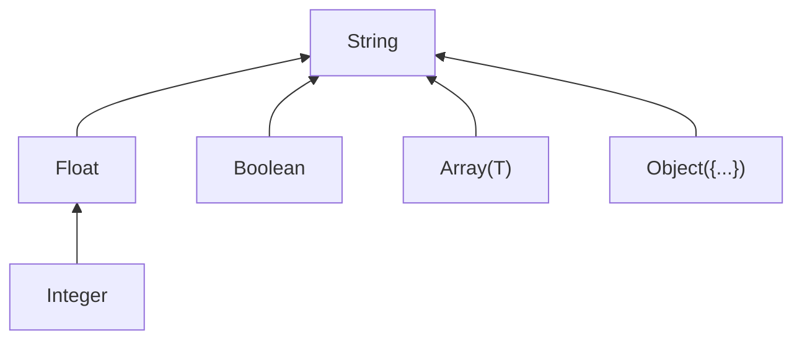

# Types & Widening

mdvs infers a type for every frontmatter field it encounters. When the same field appears with different types across files, mdvs resolves the conflict automatically through **type widening**.

## The six types

| Type | YAML example | example_kb field |
|---|---|---|
| **Boolean** | `draft: false` | `draft` in blog posts |
| **Integer** | `sample_count: 24` | `sample_count` in experiments |
| **Float** | `drift_rate: 0.023` | `drift_rate` in experiments |
| **String** | `author: Giulia Ferretti` | `author` across many files |
| **Array** | `tags: [calibration, SPR-A1]` | `tags` in projects and blog |
| **Object** | `calibration: {baseline: ...}` | `calibration` in experiment-2 |

Arrays carry an element type — `String[]`, `Integer[]`, etc. Objects carry named sub-fields, and can nest arbitrarily deep:

```yaml
calibration:
  baseline:
    wavelength: 632.8
    intensity: 0.95
  adjusted:
    wavelength: 633.1
    intensity: 0.97
```

This infers as `{baseline: {wavelength: Float, intensity: Float}, adjusted: {wavelength: Float, intensity: Float}}`.

## Type hierarchy

When two values have different types, mdvs widens to a common type. The hierarchy looks like this:



Each arrow means "widens to." **String is the top type** — every type eventually reaches it.

The one special case is Integer → Float: integers widen to floats (not directly to String) because the conversion is lossless.

Two same-category combinations widen internally instead of jumping to String:
- **Array + Array** — element types are widened recursively (e.g., Integer[] + String[] → String[])
- **Object + Object** — keys are merged, and shared keys have their values widened recursively

Everything else (Boolean + any other type, Array + scalar, Object + scalar, Array + Object) widens to String.

## Type widening in practice

When mdvs scans your files and the same field has different types, it picks the **least upper bound** — the most specific type that covers all observed values.

### Integer + Float → Float

In `example_kb`, the `wavelength_nm` field appears in three experiment notes:

```yaml
# experiment-1.md
wavelength_nm: 850       # Integer

# experiment-2.md
wavelength_nm: 632.8     # Float

# experiment-3.md
wavelength_nm: 780.0     # Float
```

Result: `wavelength_nm` is inferred as **Float**. The integer `850` is safely represented as a float.

### Integer + String → String

The `priority` field uses numbers in one project and text in another:

```yaml
# projects/alpha/overview.md
priority: 1              # Integer

# projects/beta/overview.md
priority: high           # String
```

Result: `priority` is inferred as **String**. There's no numeric type that can hold `"high"`, so mdvs widens to String.

### Boolean + any non-Boolean → String

If the same field is `true` in one file and `3` in another, there's no numeric or boolean type that can hold both. The result is String.

This doesn't happen in `example_kb` because booleans (`draft`) are used consistently — but it's a common mistake in organically grown vaults where someone writes `draft: yes` (String) instead of `draft: true` (Boolean).

### Array element widening

The `tags` field is a string array in most files, but Chiara accidentally used integers in one:

```yaml
# projects/alpha/overview.md
tags:
  - biosensor
  - metamaterial          # String[]

# projects/beta/notes/replication.md
tags:
  - 1
  - 2
  - 3                     # Integer[]
```

Result: `tags` is inferred as **String[]**. The array element types (String vs Integer) are widened to String, giving String[].

### Object key merging

When two files have the same Object field with different keys, mdvs merges all keys. If a key appears in both files with different value types, the value is widened.

In `example_kb`, the `calibration` object appears in two experiment files with different structures:

```yaml
# experiment-1.md (simpler calibration, integer values)
calibration:
  baseline:
    wavelength: 850            # Integer
    intensity: 1               # Integer
    notes: "initial reference" # only in this file

# experiment-2.md (full calibration, float values)
calibration:
  baseline:
    wavelength: 632.8          # Float
    intensity: 0.95            # Float
  adjusted:                    # only in this file
    wavelength: 633.1
    intensity: 0.97
```

Result: `calibration` is inferred as:

```json
{
  "adjusted": {
    "intensity": "Float",
    "wavelength": "Float"
  },
  "baseline": {
    "intensity": "Float",
    "notes": "String",
    "wavelength": "Float"
  }
}
```

What happened:
- `baseline` appears in both → keys merged, values widened: `wavelength` Integer + Float → Float, `intensity` Integer + Float → Float, `notes` only in experiment-1 → kept as String
- `adjusted` only in experiment-2 → kept as-is

## The full widening matrix

Every possible combination of types and its result:

|  | Boolean | Integer | Float | String | Array | Object |
|---|---|---|---|---|---|---|
| **Boolean** | Boolean | String | String | String | String | String |
| **Integer** | String | Integer | **Float** | String | String | String |
| **Float** | String | **Float** | Float | String | String | String |
| **String** | String | String | String | String | String | String |
| **Array** | String | String | String | String | Array\* | String |
| **Object** | String | String | String | String | String | Object\* |

\* Array + Array: element types are widened recursively.

\* Object + Object: keys are merged; shared keys are widened recursively.

The matrix is symmetric — `widen(A, B)` always equals `widen(B, A)`.

## Nullable

Separately from the type, mdvs tracks whether `null` was observed for a field. This is shown as a `?` suffix in output — e.g., `Float?` means "Float, but sometimes null."

### How it works

In `example_kb`, the `drift_rate` field is Float in two experiment files but null in a third:

```yaml
# experiment-1.md
drift_rate: 0.023        # Float

# experiment-2.md
drift_rate: null          # sensor malfunction — Giulia discarded the data

# experiment-3.md
drift_rate: 0.012         # Float
```

Result: `drift_rate` is inferred as **Float?** — the type is Float (null doesn't affect the type), and `nullable` is set to true.

### Null-only fields

If the only value ever observed is `null`, the type defaults to **String**:

```yaml
# blog/drafts/grant-ideas.md
review_score: null        # no real values seen
```

Result: `review_score` is inferred as **String?**.

### Key rules

- Null is **transparent** in widening — it doesn't affect the inferred type
- Null-only fields default to String (the safest fallback)
- `nullable` is a separate boolean, not part of the type itself
- In validation: null values skip type checks, but a non-nullable required field with a null value triggers a **NullNotAllowed** violation (see [Validation](./validation.md))

## String is the top type

This has two important consequences:

**In validation** — a field typed as String **never** triggers a WrongType violation. If `priority` is String, then `priority: 1`, `priority: true`, and `priority: [a, b]` all pass. The value is stored as-is.

**In storage** — when building the search index, non-string values in String-typed fields are serialized to JSON. So `priority: 1` in a String field is stored as `"1"`, not silently dropped as NULL. No data is ever lost.

There's also a leniency for Float fields: integer values like `5` pass as Float (since every integer is a valid float). This handles the common case where YAML doesn't distinguish `5` from `5.0`.

## Edge cases

- **Empty arrays** `[]` default to **String[]** — if real values are added later, the field must be re-inferred with `mdvs update --reinfer <field>` to pick up the new element type
- **Empty frontmatter** (`---` followed immediately by `---`) is a file with zero fields — not a bare file. It still counts as "having frontmatter" for inference purposes.
- **Bare files** (no `---` fences at all) are handled differently — see [Schema Inference](./schema.md)
