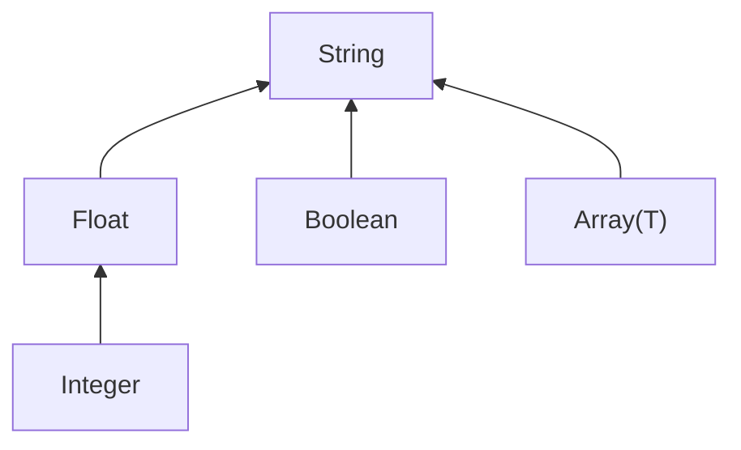

# Types & Widening

mdvs infers a type for every frontmatter field it encounters. When the same field appears with different types across files, mdvs resolves the conflict automatically through **type widening**.

## The supported types

| Type | YAML example | example_kb field |
|---|---|---|
| **Boolean** | `draft: false` | `draft` in blog posts |
| **Integer** | `sample_count: 24` | `sample_count` in experiments |
| **Float** | `drift_rate: 0.023` | `drift_rate` in experiments |
| **String** | `author: Giulia Ferretti` | `author` across many files |
| **Array(Scalar)** | `tags: [calibration, SPR-A1]` | `tags` in projects and blog |

The on-disk type grammar is tight:

```text
Type   := Scalar | Array(Scalar)
Scalar := String | Integer | Float | Boolean
```

`Array(Array(...))` and `Array(Object{...})` are not representable on disk — see [Arrays of structured items](#arrays-of-structured-items) below for the workaround.

**Nested Objects in YAML are expressed as dotted-name leaf fields** in `mdvs.toml`. A frontmatter shape like:

```yaml
calibration:
  baseline:
    wavelength: 632.8
    intensity: 0.95
  adjusted:
    wavelength: 633.1
    intensity: 0.97
```

infers as five separate leaf fields, one per nested path:

- `calibration.baseline.wavelength` → Float
- `calibration.baseline.intensity` → Float
- `calibration.adjusted.wavelength` → Float
- `calibration.adjusted.intensity` → Float

Each leaf gets its own nullability and `allowed`/`required` glob set. This avoids the readability and per-leaf-validation problems of monolithic Object types. Top-level Object types are not supported in `mdvs.toml`, and neither are Objects nested inside Array fields — see [Arrays of structured items](#arrays-of-structured-items) below.

## Arrays of structured items

A YAML field like:

```yaml
measurements:
  - timestamp: "14:02:11"
    value: 0.612
  - timestamp: "14:03:00"
    value: 0.598
```

has no first-class representation on disk in v0. Inference detects the `Array(Object{...})` shape, **skips the field**, and emits a warning to stderr:

```
warning: skipped field 'measurements' — Array(Object{...}) isn't representable on disk.
  Consider parallel scalar arrays (see TODO-0156). (first observed in projects/alpha/notes/experiment-2.md)
```

The recommended workaround is **parallel scalar arrays** — one field per element-leaf. Replace the YAML above with:

```yaml
measurement_timestamps: ["14:02:11", "14:03:00"]
measurement_values: [0.612, 0.598]
```

and the corresponding `mdvs.toml`:

```toml
[[fields.field]]
name = "measurement_timestamps"
type = "Array(String)"

[[fields.field]]
name = "measurement_values"
type = "Array(Float)"
```

The downside is the loss of per-element grouping — there's no schema-level guarantee that `measurement_timestamps[3]` and `measurement_values[3]` belong to the same record. A first-class Array-of-structured-item representation is tracked in TODO-0156.

## Type hierarchy

When two values have different types, mdvs widens to a common type. The hierarchy looks like this:



Each arrow means "widens to." **String is the top type** — every type eventually reaches it.

The one special case is Integer → Float: integers widen to floats (not directly to String) because the conversion is lossless.

Two same-category combinations widen internally instead of jumping to String:
- **Array + Array** — element types are widened recursively (e.g., `Array(Integer)` + `Array(String)` → `Array(String)`)
- **Object + Object** — at the leaf level: each dotted path's type is widened independently across files. A file with `cal.wave = 850` (Integer) and another with `cal.wave = 632.8` (Float) yields `cal.wave: Float`. New leaf paths in some files are added to the schema; leaves absent from some files affect nullability/required-globs naturally.

Everything else (Boolean + any other type, Array + scalar, Object + scalar) widens to String. The one exception is **Array containing Object** — `Array(Object{...})` isn't representable on disk, so inference drops the field with a warning instead of widening to String (see [Arrays of structured items](#arrays-of-structured-items)).

## Type widening in practice

When mdvs scans your files and the same field has different types, it picks the **least upper bound** — the most specific type that covers all observed values.

### Integer + Float → Float

In `example_kb`, the `wavelength_nm` field appears in three experiment notes:

```yaml
# experiment-1.md
wavelength_nm: 850       # Integer

# experiment-2.md
wavelength_nm: 632.8     # Float

# experiment-3.md
wavelength_nm: 780.0     # Float
```

Result: `wavelength_nm` is inferred as **Float**. The integer `850` is safely represented as a float.

### Integer + String → String

The `priority` field uses numbers in one project and text in another:

```yaml
# projects/alpha/overview.md
priority: 1              # Integer

# projects/beta/overview.md
priority: high           # String
```

Result: `priority` is inferred as **String**. There's no numeric type that can hold `"high"`, so mdvs widens to String.

### Boolean + any non-Boolean → String

If the same field is `true` in one file and `3` in another, there's no numeric or boolean type that can hold both. The result is String.

This doesn't happen in `example_kb` because booleans (`draft`) are used consistently — but it's a common mistake in organically grown vaults where someone writes `draft: yes` (String) instead of `draft: true` (Boolean).

### Array element widening

The `tags` field is a string array in most files, but one file accidentally used integers:

```yaml
# projects/alpha/overview.md
tags:
  - biosensor
  - metamaterial          # Array(String)

# projects/beta/notes/replication.md
tags:
  - 1
  - 2
  - 3                     # Array(Integer)
```

Result: `tags` is inferred as **`Array(String)`**. The array element types (String vs Integer) are widened to String, giving `Array(String)`.

### Object leaf merging (dotted-name flattening)

When two files have nested keys at the same paths, each leaf is inferred independently. New leaves seen in one file but not another are added to the schema; their `required` glob naturally narrows to just the files that contain them.

In `example_kb`, the `calibration` object appears in two experiment files with different structures:

```yaml
# experiment-1.md (simpler calibration, integer values)
calibration:
  baseline:
    wavelength: 850            # Integer
    intensity: 1               # Integer
    notes: "initial reference" # only in this file

# experiment-2.md (full calibration, float values)
calibration:
  baseline:
    wavelength: 632.8          # Float
    intensity: 0.95            # Float
  adjusted:                    # only in this file
    wavelength: 633.1
    intensity: 0.97
```

Result: five dotted-name leaf fields are inferred in `mdvs.toml`:

```toml
[[fields.field]]
name = "calibration.adjusted.intensity"
type = "Float"

[[fields.field]]
name = "calibration.adjusted.wavelength"
type = "Float"

[[fields.field]]
name = "calibration.baseline.intensity"
type = "Float"
preprocess = ["widen_int_to_float"]   # Integer + Float mix → opted in

[[fields.field]]
name = "calibration.baseline.notes"
type = "String"

[[fields.field]]
name = "calibration.baseline.wavelength"
type = "Float"
preprocess = ["widen_int_to_float"]
```

What happened:
- `calibration.baseline.wavelength` seen as both Integer (850) and Float (632.8) → widened to Float with `widen_int_to_float` preprocessor recording the mix
- `calibration.baseline.intensity` similar: Integer (1) + Float (0.95) → Float with the preprocessor
- `calibration.baseline.notes` only in experiment-1 → still inferred as String (with a `required` glob narrowed to just the files that have it)
- `calibration.adjusted.*` only in experiment-2 → inferred from that file alone

The user-facing schema is flat, but its semantics still match the YAML's nested shape. Validation, storage, and `--where` queries all operate on the natural nested structure — the dotted-name form is purely a `mdvs.toml` UX choice.

## The full widening matrix

Every possible combination of types and its result:

|  | Boolean | Integer | Float | String | Array | Object |
|---|---|---|---|---|---|---|
| **Boolean** | Boolean | String | String | String | String | String |
| **Integer** | String | Integer | **Float** | String | String | String |
| **Float** | String | **Float** | Float | String | String | String |
| **String** | String | String | String | String | String | String |
| **Array** | String | String | String | String | Array\* | dropped\*\* |
| **Object** | String | String | String | String | dropped\*\* | Object\* |

\* Array + Array: element types are widened recursively.

\* Object + Object: not a top-level on-disk type. Nested Objects in YAML flatten to dotted-name leaves before widening; each leaf path is widened independently.

\*\* Inference observed Array(Object{...}) — not representable on disk in v0. The field is dropped from the schema and a warning is emitted (see [Arrays of structured items](#arrays-of-structured-items)).

The matrix is symmetric — `widen(A, B)` always equals `widen(B, A)`.

## Nullable

Separately from the type, mdvs tracks whether `null` was observed for a field. This is shown as a `?` suffix in output — e.g., `Float?` means "Float, but sometimes null."

### How it works

In `example_kb`, the `drift_rate` field is Float in two experiment files but null in a third:

```yaml
# experiment-1.md
drift_rate: 0.023        # Float

# experiment-2.md
drift_rate: null          # sensor malfunction — Giulia discarded the data

# experiment-3.md
drift_rate: 0.012         # Float
```

Result: `drift_rate` is inferred as **Float?** — the type is Float (null doesn't affect the type), and `nullable` is set to true.

### Null-only fields

If the only value ever observed is `null`, the type defaults to **String**:

```yaml
# blog/drafts/grant-ideas.md
review_score: null        # no real values seen
```

Result: `review_score` is inferred as **String?**.

### Key rules

- Null is **transparent** in widening — it doesn't affect the inferred type
- Null-only fields default to String (the safest fallback)
- `nullable` is a separate boolean, not part of the type itself
- In validation: null values skip type checks, but a non-nullable required field with a null value triggers a `NullNotAllowed` violation (see [Validation](./validation.md))

## Widening and preprocessors

Widening picks the type. **Preprocessors** are how the schema declares what coercions were needed to get there. Inference auto-populates them — you rarely write them by hand.

When inference observes a field as a mix of types (some files have `priority: 1`, others `priority: high`), it widens to `String` and writes:

```toml
[[fields.field]]
name = "priority"
type = "String"
preprocess = ["coerce_to_string"]
```

The `coerce_to_string` entry tells validation: "before checking this value is a string, serialize whatever you find to its JSON representation." Without it, the field is strict — integers and booleans fail validation.

Same for Float: a mix of `5` and `5.0` widens to `Float` with `preprocess = ["widen_int_to_float"]`. Without it, integers fail the float check.

The two built-in Stage 2 preprocessors:

| Preprocessor | Applies to | Effect |
|---|---|---|
| `coerce_to_string` | `String`, `Array(String)` | Serialize non-strings to their JSON string representation before validation |
| `widen_int_to_float` | `Float`, `Array(Float)` | Treat integer values as their float equivalent |

**`preprocess = []` means strict.** If you delete a preprocessor from `mdvs.toml`, the field rejects values that would have been coerced. Conversely, you can hand-add a preprocessor to a strict-inferred field if you want to accept type variation.

**In storage** — when validation accepts a coerced value, the coerced form is what gets stored. A `priority: 1` value with `coerce_to_string` becomes `"1"` in the search index. No data is silently dropped.

Re-run `mdvs update reinfer <field>` to refresh both the inferred type and the inferred preprocessors after editing source files.

## Edge cases

- **Empty arrays** `[]` default to **`Array(String)`** — if real values are added later, the field must be re-inferred with `mdvs update reinfer <field>` to pick up the new element type
- **Empty frontmatter** (`---` followed immediately by `---`) is a file with zero fields — not a bare file. It still counts as "having frontmatter" for inference purposes.
- **Bare files** (no `---` fences at all) are handled differently — see [Schema Inference](./schema.md)
