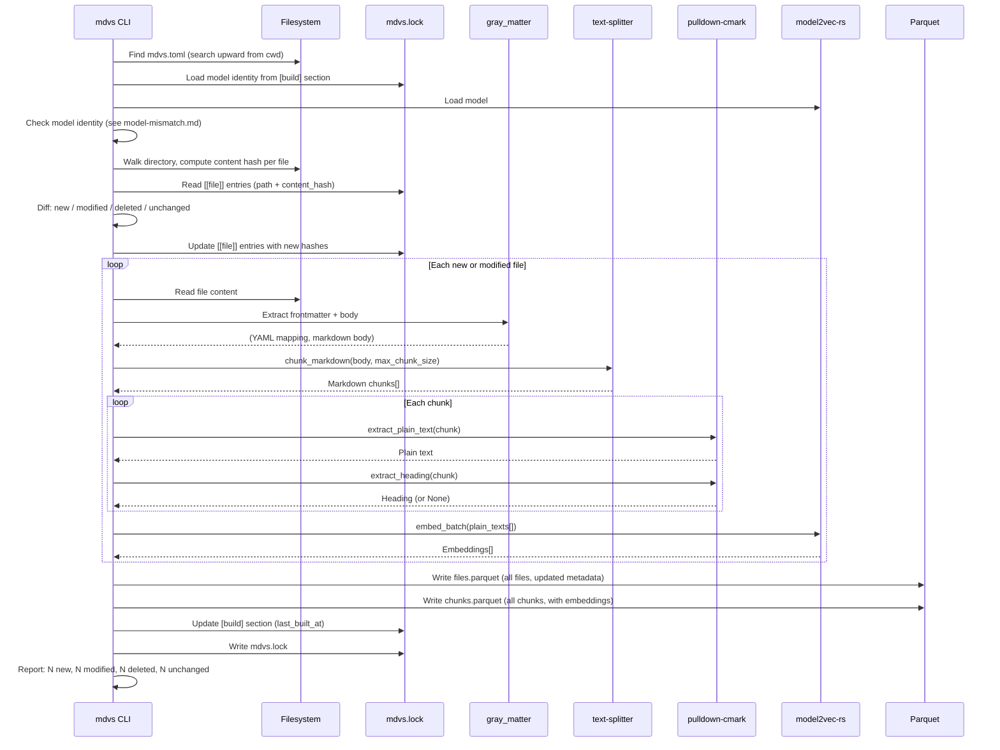

# Workflow: Build

**Status: DRAFT**

**Cross-references:** [Terminology](../01-terminology.md) | [Crate: mdvs](../10-crates/mdvs/spec.md) | [Storage Schema](../20-storage/schema.md)

---

## Overview

The build workflow processes markdown files into the `.mdvs/` artifact: extract frontmatter, split into chunks, compute embeddings, and write compressed Parquet files. Default mode is incremental — only changed files are reprocessed. Analogous to `cargo build`.

The build implicitly refreshes the lock file before processing, like `cargo build` updates `Cargo.lock`.

---

## Actors

| Actor | Role |
|---|---|
| **CLI** | Orchestrates the pipeline |
| **Filesystem** | Source of `.md` files |
| **gray_matter** | Frontmatter extraction |
| **text-splitter** | Semantic chunking |
| **pulldown-cmark** | Markdown → plain text |
| **model2vec-rs** | Embedding inference |
| **Parquet/DataFusion** | Storage (write Parquet files) |

---

## Sequence: Incremental Build

---

## Diff Logic

Content hashes in `mdvs.lock` `[[file]]` entries are compared against freshly computed hashes from the filesystem:

| Category | Condition | Action |
|---|---|---|
| **New** | File on disk, not in lock | Process: extract + chunk + embed |
| **Modified** | File on disk, in lock, hash differs | Reprocess: extract + chunk + embed |
| **Deleted** | In lock, not on disk | Remove from artifact |
| **Unchanged** | File on disk, in lock, hash matches | Carry forward from existing Parquet |

Content hash is computed over the full file content (frontmatter + body), not just the body. This means frontmatter-only changes (e.g., updating tags) also trigger reprocessing.

---

## Full Build Mode (`--full`)

Skips the diff phase. Removes existing `.mdvs/` and processes all files from scratch:

1. Delete `.mdvs/` directory
2. Process every file (extract, chunk, embed)
3. Write fresh Parquet files

Use after a model change or when the artifact is suspected to be inconsistent.

---

## Batch Processing

Embeddings are computed in batches for efficiency. `model2vec-rs` supports batch inference. The batch size is an implementation detail (e.g., 256 chunks per batch), not user-configurable.

The progress bar (via `indicatif`) shows per-file progress during the extract+chunk phase and per-batch progress during embedding.

---

## Edge Cases

| Case | Behavior |
|---|---|
| File with no frontmatter | Field columns = NULL, metadata = `{}`, body still chunked and embedded |
| File with unparseable frontmatter | Log warning, treat as no frontmatter (still build the full content) |
| Empty file | Skip: no content to chunk or embed |
| Very large file (>1MB) | Normal processing: `text-splitter` handles arbitrary sizes via cascading chunk splits |
| Binary file matched by glob | Skip: if not valid UTF-8, skip silently |
| Non-UTF8 filename | Skip with warning |
| File changes between hash computation and read | Race condition: content hash won't match on next build, triggering a reprocess. Self-correcting. |
| No `.mdvs/` directory | First build: create it |
| Config not found | Error: "mdvs.toml not found. Run `mdvs init` first." |

---

## Related Documents

- [Terminology](../01-terminology.md) — definitions for chunk, plain text, content hash, build
- [Crate: mdvs](../10-crates/mdvs/spec.md) — `ingest`, `embed`, `storage` modules
- [Storage Schema](../20-storage/schema.md) — Parquet file schemas
- [Workflow: Model Mismatch](model-mismatch.md) — identity check before building
- [Workflow: Init](init.md) — must run before first build
