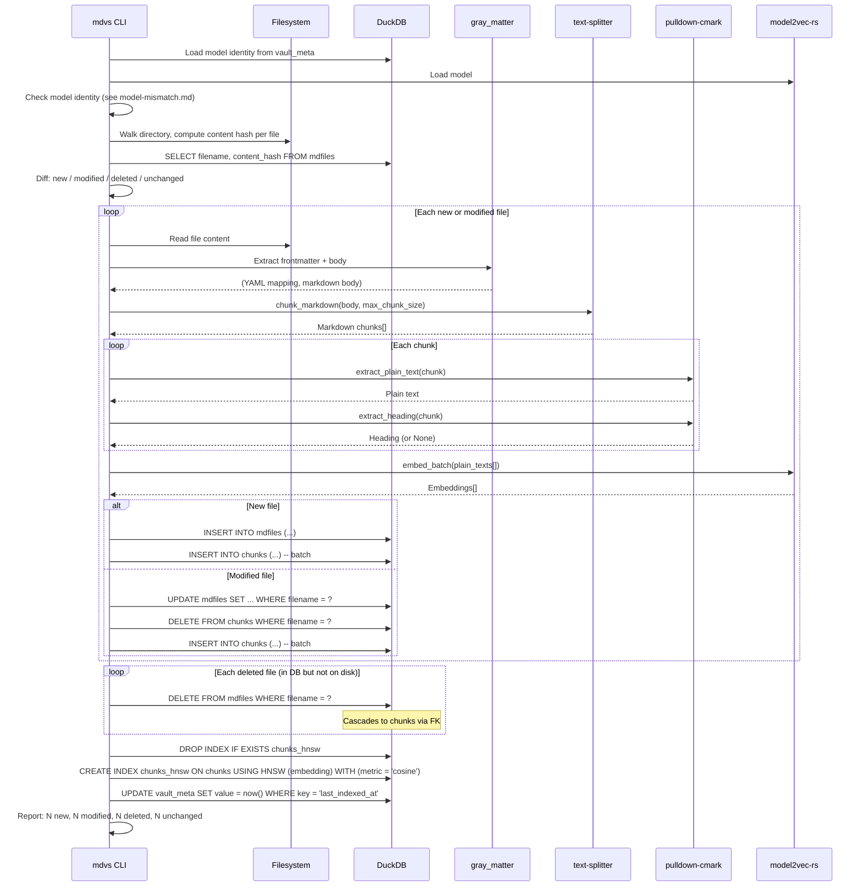

# Workflow: Index

**Status: DRAFT**

**Cross-references:** [Terminology](../01-terminology.md) | [Crate: mdvs](../10-crates/mdvs/spec.md) | [Database Schema](../20-database/schema.md)

---

## Overview

The index workflow processes markdown files into the database: extract frontmatter, split into chunks, compute embeddings, and store everything in DuckDB. Default mode is incremental — only changed files are reprocessed.

---

## Actors

| Actor | Role |
|---|---|
| **CLI** | Orchestrates the pipeline |
| **Filesystem** | Source of `.md` files |
| **gray_matter** | Frontmatter extraction |
| **text-splitter** | Semantic chunking |
| **pulldown-cmark** | Markdown → plain text |
| **model2vec-rs** | Embedding inference |
| **DuckDB** | Storage and HNSW index |

---

## Sequence: Incremental Index

---

## Diff Logic

| Category | Condition | Action |
|---|---|---|
| **New** | File on disk, not in DB | Insert file + chunks + embeddings |
| **Modified** | File on disk, in DB, hash differs | Update file, delete old chunks, insert new chunks + embeddings |
| **Deleted** | In DB, not on disk | Delete file (cascades to chunks) |
| **Unchanged** | File on disk, in DB, hash matches | Skip |

Content hash is computed over the full file content (frontmatter + body), not just the body. This means frontmatter-only changes (e.g., updating tags) also trigger reprocessing.

---

## Full Index Mode (`--full`)

Skips the diff phase. Processes all files as if they were new:

1. Truncate `mdfiles` and `chunks` tables
2. Process every file (extract, chunk, embed, insert)
3. Rebuild HNSW index

Equivalent to reprocessing everything, but unlike `reindex`, it also re-reads files from disk (not just re-embeds from stored plain text).

---

## Reindex

`mdvs reindex` is a specialized variant that only recomputes embeddings:

1. Check model identity — update `vault_meta` with new model info
2. `UPDATE chunks SET embedding = NULL`
3. For each chunk, re-embed from stored `plain_text`
4. Rebuild HNSW index

No filesystem access, no re-parsing. Because `plain_text` is stored per-chunk, this is a pure re-embedding operation.

---

## Batch Processing

Embeddings are computed in batches for efficiency. `model2vec-rs` supports batch inference. The batch size is an implementation detail (e.g., 256 chunks per batch), not user-configurable.

The progress bar (via `indicatif`) shows per-file progress during the extract+chunk phase and per-batch progress during embedding.

---

## Edge Cases

| Case | Behavior |
|---|---|
| File with no frontmatter | Promoted columns = NULL, metadata = `{}`, body still chunked and embedded |
| File with unparseable frontmatter | Log warning, treat as no frontmatter (still index the full content) |
| Empty file | Skip: no content to chunk or embed |
| Very large file (>1MB) | Normal processing: `text-splitter` handles arbitrary sizes via cascading chunk splits |
| Binary file matched by glob | Skip: content hash still computed, but if not valid UTF-8, skip silently |
| Non-UTF8 filename | Skip with warning |
| File changes between hash computation and read | Race condition: content hash won't match on next index run, triggering a re-process. Self-correcting. |
| Database locked | DuckDB handles single-writer. If another process holds the lock, error with clear message. |

---

## Related Documents

- [Terminology](../01-terminology.md) — definitions for chunk, plain text, content hash, incremental indexing
- [Crate: mdvs](../10-crates/mdvs/spec.md) — `ingest`, `embed`, `db` modules
- [Database Schema](../20-database/schema.md) — tables written to during indexing
- [Workflow: Model Mismatch](model-mismatch.md) — identity check before indexing
- [Workflow: Init](init.md) — must run before first index
