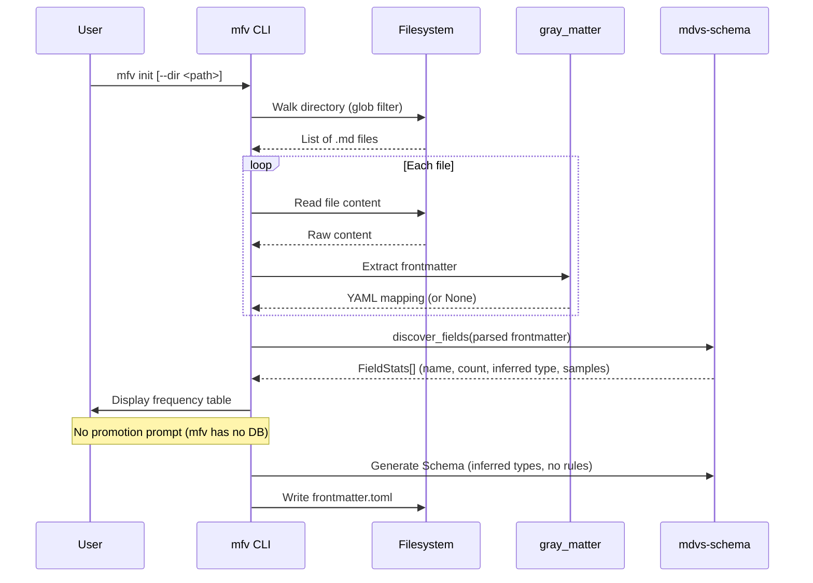

# Workflow: Init

**Status: DRAFT**

**Cross-references:** [Terminology](../01-terminology.md) | [Crate: mdvs](../10-crates/mdvs/spec.md) | [Crate: mfv](../10-crates/mfv/spec.md) | [Database Schema](../20-database/schema.md)

---

## Overview

The init workflow creates a new vault index. Two variants exist: `mfv init` (schema-only) and `mdvs init` (schema + database + model). They share the field discovery and type inference steps.

---

## Actors

| Actor | Role |
|---|---|
| **User** | Invokes init, selects promoted fields (interactive) or provides `--promoted` |
| **CLI** | Orchestrates the workflow |
| **Filesystem** | Source of `.md` files |
| **mdvs-schema** | Field discovery, type inference, TOML generation |
| **gray_matter** | Frontmatter extraction |
| **DuckDB** | Database creation, extension install (mdvs only) |
| **model2vec-rs** | Model download and caching (mdvs only) |
| **HuggingFace** | Model weight hosting (mdvs only) |

---

## Sequence: `mfv init`



### End States

| State | Condition |
|---|---|
| **Success** | `frontmatter.toml` written with inferred field types |
| **No files found** | Error: no .md files match the glob pattern |
| **No frontmatter** | Success: `frontmatter.toml` with empty `[fields]` section |
| **File exists** | Error (unless `--force`): `frontmatter.toml` already exists |

---

## Sequence: `mdvs init`

```mermaid
sequenceDiagram
    participant U as User
    participant CLI as mdvs CLI
    participant FS as Filesystem
    participant GM as gray_matter
    participant S as mdvs-schema
    participant DB as DuckDB
    participant M as model2vec-rs
    participant HF as HuggingFace

    U->>CLI: mdvs init [options]

    %% Check preconditions
    CLI->>FS: Check if .mdvs.duckdb exists
    alt Database exists
        CLI->>U: Error: database already exists
    end

    %% Field discovery (shared with mfv)
    CLI->>FS: Walk directory (glob filter)
    FS-->>CLI: List of .md files

    loop Each file (up to sample size)
        CLI->>FS: Read file content
        FS-->>CLI: Raw content
        CLI->>GM: Extract frontmatter
        GM-->>CLI: YAML mapping (or None)
    end

    CLI->>S: discover_fields(parsed frontmatter)
    S-->>CLI: FieldStats[]

    %% Promotion selection
    alt --promoted flag given
        CLI->>CLI: Use provided field list
    else Interactive mode
        CLI->>U: Display frequency table + promotion prompt
        U-->>CLI: Selected fields
    end

    %% Write config files
    CLI->>FS: Write frontmatter.toml (with promoted flags)
    CLI->>FS: Write .mdvs.toml (model, chunking settings)

    %% Model download
    CLI->>M: Load model (model_id, revision)
    M->>HF: Download weights (if not cached)
    HF-->>M: Model weights (~30MB)
    M-->>CLI: Model + ModelIdentity

    Note over CLI: Show progress bar during download

    %% Database setup
    CLI->>DB: Create .mdvs.duckdb
    CLI->>DB: INSTALL vss FROM community; LOAD vss;
    CLI->>DB: CREATE TABLE vault_meta (...)
    CLI->>DB: INSERT vault_meta keys (model identity, promoted fields, etc.)
    CLI->>DB: CREATE TABLE mdfiles (...dynamic promoted columns...)
    CLI->>DB: CREATE TABLE chunks (...FLOAT[N]...)

    CLI->>U: Init complete. Run `mdvs index` to build the index.
```

### End States

| State | Condition |
|---|---|
| **Success** | Database created, config files written, model cached |
| **DB exists** | Error: `.mdvs.duckdb` already exists at target path |
| **No files found** | Error: no .md files match the glob pattern |
| **Model download failed** | Error: network issue or invalid model ID |
| **vss install failed** | Error: network issue or version incompatibility |

---

## Edge Cases

| Case | Behavior |
|---|---|
| `frontmatter.toml` already exists | `mdvs init` reads it and uses existing field definitions (does not re-scan). Adds `promoted` flags for selected fields. |
| All files lack frontmatter | Success. No promoted fields, empty `[fields]` section. `mdfiles` table has only fixed columns. |
| Mixed frontmatter formats (YAML/TOML/JSON) | `gray_matter` handles all three. Type inference works across formats. |
| Very large vault (>10k files) | Scan samples first 100 files for field discovery. `--promoted` bypasses scanning entirely. |
| Interrupted download | Partial state: config files may exist but database may not. User re-runs `mdvs init --force` or deletes partial files. |
| Invalid `--promoted` field name | Error: field "foo" not found in frontmatter of scanned files. |

---

## Related Documents

- [Crate: mdvs](../10-crates/mdvs/spec.md) — `init` command implementation
- [Crate: mfv](../10-crates/mfv/spec.md) — `init` command implementation
- [Crate: mdvs-schema](../10-crates/mdvs-schema/spec.md) — `discover_fields`, type inference
- [Database Schema](../20-database/schema.md) — tables created during init
- [Configuration: frontmatter.toml](../40-configuration/frontmatter-toml.md) — generated during init
- [Configuration: .mdvs.toml](../40-configuration/mdvs-toml.md) — generated during init
