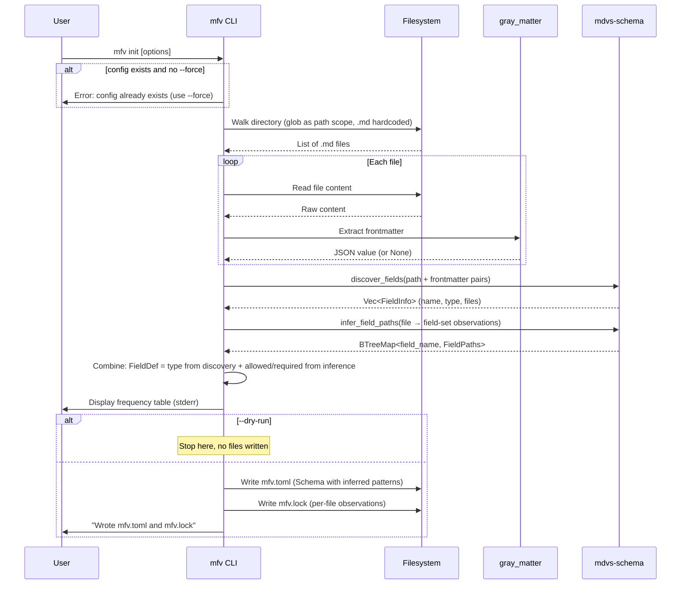
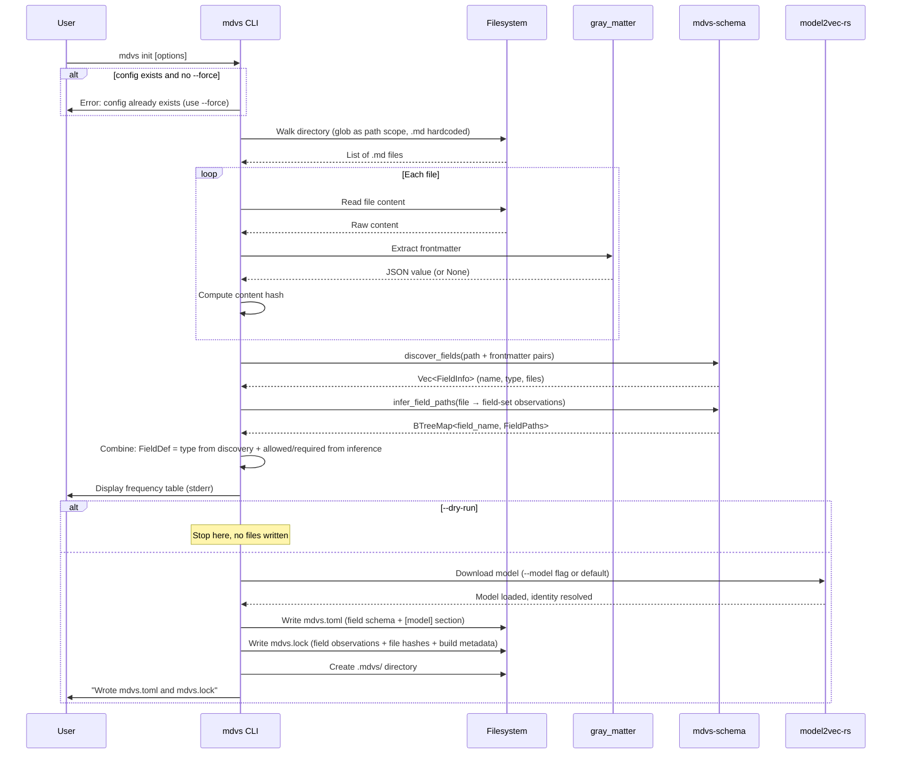

# Workflow: Init

**Status: DRAFT**

**Cross-references:** [Terminology](../01-terminology.md) | [Crate: mfv](../10-crates/mfv/spec.md) | [Crate: mdvs](../10-crates/mdvs/spec.md) | [Crate: mdvs-schema](../10-crates/mdvs-schema/spec.md) | [Workflow: Inference](inference.md)

---

## Overview

The init workflow creates a new field schema and lock file by scanning markdown files, discovering fields, and inferring allowed/required patterns via tree inference.

Both tools have an init command. `mfv init` creates `mfv.toml` + `mfv.lock`. `mdvs init` subsumes `mfv init` — it does everything `mfv init` does plus model setup, producing `mdvs.toml` + `mdvs.lock`.

---

## Actors

| Actor | Role |
|---|---|
| **User** | Invokes init |
| **CLI** | Orchestrates the workflow |
| **Filesystem** | Source of `.md` files |
| **gray_matter** | Frontmatter extraction |
| **mdvs-schema** | Field discovery, type inference, tree inference, TOML generation |

---

## Sequence: `mfv init`

```
mfv init [--dir <path>] [--glob <pattern>] [--config <path>] [--force] [--dry-run]
```

### CLI Flags

| Flag | Default | Description |
|---|---|---|
| `--dir <path>` | `.` | Directory to scan |
| `--glob <pattern>` | `**` | File matching glob |
| `--config <path>` | `mfv.toml` | Output config file path |
| `--force` | off | Overwrite existing config and lock |
| `--dry-run` | off | Print table only, write nothing |

### Flow



### Frequency Table Output

Printed to stderr:

```
Scanning .
42 markdown files considered

 Field       Type       Count
 title       string     38/42
 tags        string[]   35/42
 date        date       30/42
 draft       boolean     5/42
 author      string      3/42
```

### End States

| State | Condition | Exit Code |
|---|---|---|
| **Success** | Config and lock written | 0 |
| **Dry-run** | Table printed, no files written | 0 |
| **Config exists** | Error: config already exists (suggest `--force`) | 2 |
| **No files found** | Error: no markdown files match the glob | 2 |
| **Dir not found** | Error: specified directory doesn't exist | 2 |

---

## Output Files

### `mfv.toml`

Contains `[directory]` section and `[[fields.field]]` entries. Each field has explicit `allowed` and `required` patterns from tree inference. See [Configuration](../40-configuration/frontmatter-toml.md).

### `mfv.lock`

Contains `[discovery]` metadata and `[[field]]` entries with per-file observation lists. See [Configuration: Lock File](../40-configuration/frontmatter-toml.md#lock-file-mfvlock).

---

## Sequence: `mdvs init`

```
mdvs init [path] [--model <id>] [--glob <pattern>] [--config <path>]
                  [--force] [--dry-run] [--include-bare-files]
```

`mdvs init` subsumes `mfv init`. It performs all the same field discovery and inference steps, then adds model setup.

### Additional Flags (beyond mfv init)

| Flag | Default | Description |
|---|---|---|
| `--model <id>` | `minishlab/potion-multilingual-128M` | HuggingFace model ID |

### Flow



### Output Files

#### `mdvs.toml`

Contains everything `mfv.toml` has (`[directory]` + `[[fields.field]]` entries) plus search-specific sections:

```toml
[directory]
glob = "**"
include_bare_files = false

[[fields.field]]
name = "title"
type = "string"
allowed = ["**"]
# ... more fields ...

[model]
name = "minishlab/potion-multilingual-128M"

[chunking]
max_chunk_size = 1000

[behavior]
on_stale = "auto"

[search]
default_limit = 10
snippet_length = 120
```

See [Configuration: mdvs.toml](../40-configuration/mdvs-toml.md).

#### `mdvs.lock`

Superset of `mfv.lock`. Contains the same field observations plus per-file content hashes and build metadata:

```toml
# Auto-generated by mdvs init. Do not edit.
# To regenerate: mdvs init --force

[discovery]
total_files = 42
files_with_frontmatter = 38
glob = "**"
generated_at = "2025-06-12T10:00:00"

[[field]]
name = "title"
type = "string"
files = ["blog/a.md", "blog/b.md", "notes/c.md"]

[[field]]
name = "tags"
type = "string[]"
files = ["blog/a.md"]

[[file]]
path = "blog/a.md"
content_hash = "abc123def456"

[[file]]
path = "blog/b.md"
content_hash = "789ghi012jkl"

[build]
model_id = "minishlab/potion-multilingual-128M"
model_dimension = 256
model_revision = "a1b2c3d4e5f6"
max_chunk_size = 1000
```

The `[build]` section is written at init (with model identity from download) and updated after each `mdvs build`. The `[[file]]` entries are updated by both `mdvs update` and `mdvs build`.

---

## Edge Cases

| Case | Behavior |
|---|---|
| Config already exists | Error with exit 2, suggests `--force`. With `--force`, overwrites both config and lock. |
| All files lack frontmatter | Error: no markdown files found (only files with frontmatter count). |
| Mixed frontmatter formats (YAML/TOML) | `gray_matter` handles both. Type inference works across formats. |
| Single file | Tree inference still works; produces root-level `*` patterns. |
| `--dry-run` with `--config` | Config path is accepted but no files are written. |

---

## Related Documents

- [Crate: mfv](../10-crates/mfv/spec.md) — `mfv init` command implementation
- [Crate: mdvs](../10-crates/mdvs/spec.md) — `mdvs init` command implementation
- [Crate: mdvs-schema](../10-crates/mdvs-schema/spec.md) — `discover_fields`, `infer_field_paths`
- [Workflow: Inference](inference.md) — tree inference algorithm
- [Configuration: Field Schema](../40-configuration/frontmatter-toml.md) — generated file formats
- [Configuration: mdvs.toml](../40-configuration/mdvs-toml.md) — search-specific config sections
