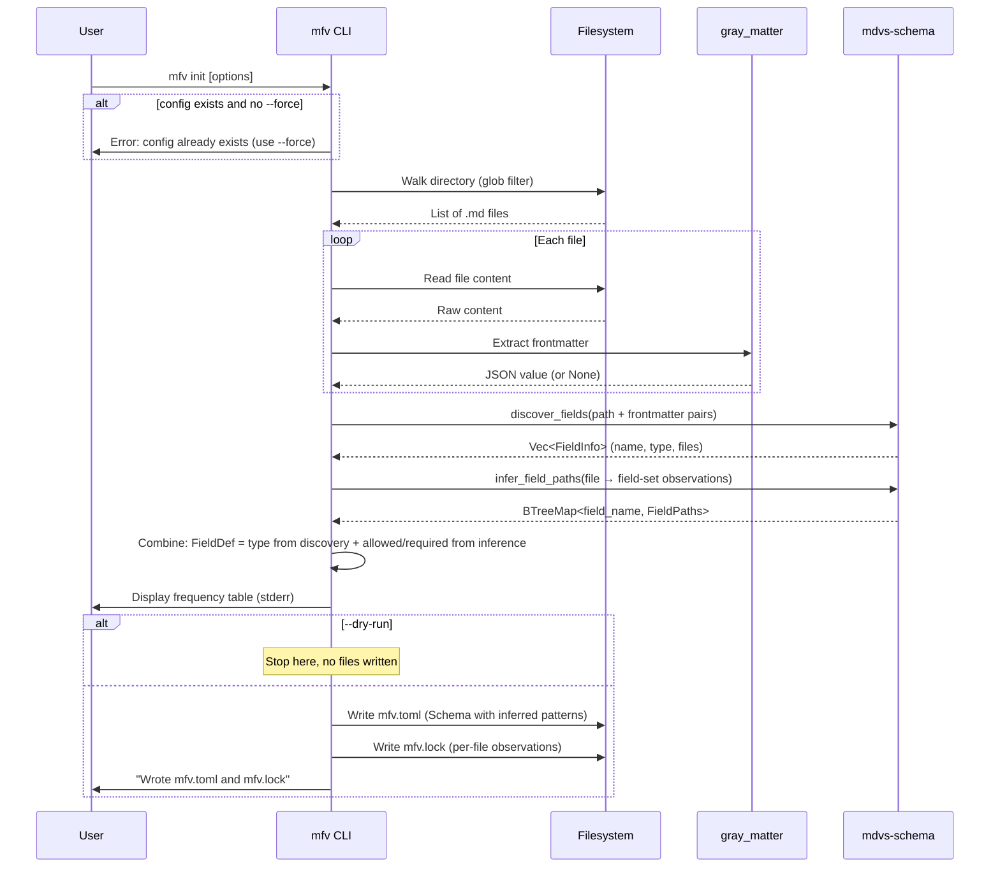

# Workflow: Init

**Status: DRAFT**

**Cross-references:** [Terminology](../01-terminology.md) | [Crate: mfv](../10-crates/mfv/spec.md) | [Crate: mdvs-schema](../10-crates/mdvs-schema/spec.md) | [Workflow: Inference](inference.md)

---

## Overview

The init workflow creates a new field schema and lock file by scanning markdown files, discovering fields, and inferring allowed/required patterns via tree inference.

Currently implemented: `mfv init`. `mdvs init` is planned but not yet implemented.

---

## Actors

| Actor | Role |
|---|---|
| **User** | Invokes init |
| **CLI** | Orchestrates the workflow |
| **Filesystem** | Source of `.md` files |
| **gray_matter** | Frontmatter extraction |
| **mdvs-schema** | Field discovery, type inference, tree inference, TOML generation |

---

## Sequence: `mfv init`

```
mfv init [--dir <path>] [--glob <pattern>] [--config <path>] [--force] [--dry-run]
```

### CLI Flags

| Flag | Default | Description |
|---|---|---|
| `--dir <path>` | `.` | Directory to scan |
| `--glob <pattern>` | `**` | File matching glob |
| `--config <path>` | `mfv.toml` | Output config file path |
| `--force` | off | Overwrite existing config and lock |
| `--dry-run` | off | Print table only, write nothing |

### Flow



### Frequency Table Output

Printed to stderr:

```
Scanning 42 files...
Found 42 markdown files, 38 with frontmatter

 Field       Type       Count
 title       string     38/42
 tags        string[]   35/42
 date        date       30/42
 draft       boolean     5/42
 author      string      3/42
```

### End States

| State | Condition | Exit Code |
|---|---|---|
| **Success** | Config and lock written | 0 |
| **Dry-run** | Table printed, no files written | 0 |
| **Config exists** | Error: config already exists (suggest `--force`) | 2 |
| **No files found** | Error: no markdown files match the glob | 2 |
| **Dir not found** | Error: specified directory doesn't exist | 2 |

---

## Output Files

### `mfv.toml`

Contains `[directory]` section and `[[fields.field]]` entries. Each field has explicit `allowed` and `required` patterns from tree inference. See [Configuration](../40-configuration/frontmatter-toml.md).

### `mfv.lock`

Contains `[discovery]` metadata and `[[field]]` entries with per-file observation lists. See [Configuration: Lock File](../40-configuration/frontmatter-toml.md#lock-file-mfvlock).

---

## Edge Cases

| Case | Behavior |
|---|---|
| Config already exists | Error with exit 2, suggests `--force`. With `--force`, overwrites both config and lock. |
| All files lack frontmatter | Error: no markdown files found (only files with frontmatter count). |
| Mixed frontmatter formats (YAML/TOML) | `gray_matter` handles both. Type inference works across formats. |
| Single file | Tree inference still works; produces root-level `*` patterns. |
| `--dry-run` with `--config` | Config path is accepted but no files are written. |

---

## Related Documents

- [Crate: mfv](../10-crates/mfv/spec.md) — `init` command implementation
- [Crate: mdvs-schema](../10-crates/mdvs-schema/spec.md) — `discover_fields`, `infer_field_paths`
- [Workflow: Inference](inference.md) — tree inference algorithm
- [Configuration](../40-configuration/frontmatter-toml.md) — generated file formats
