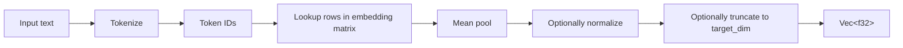
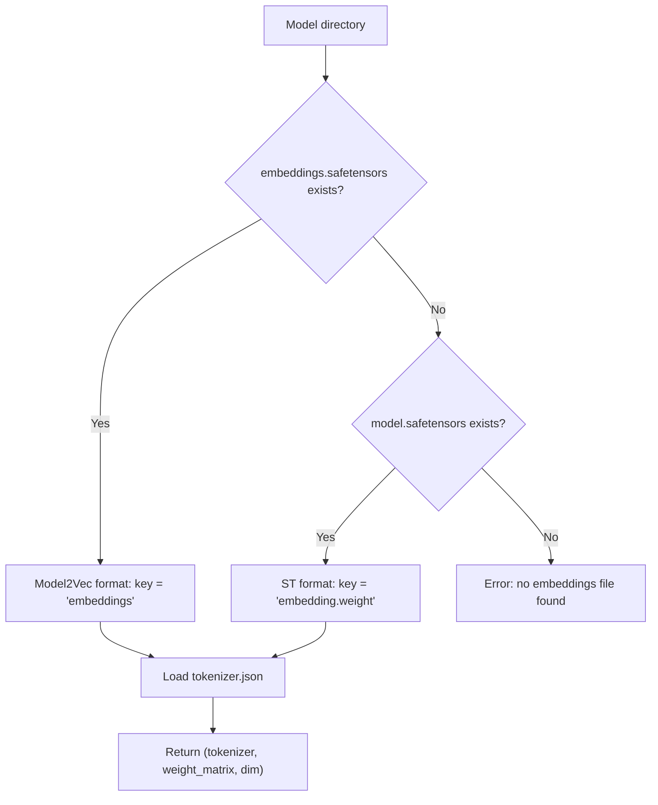

# Workflow: Model Loading

**Status: DRAFT**

**Cross-references:** [Terminology](../01-terminology.md) | [Crate: mdvs](../10-crates/mdvs/spec.md) | [Model Mismatch](model-mismatch.md) | [Configuration: mdvs.toml](../40-configuration/mdvs-toml.md)

---

## Overview

mdvs supports two static embedding model formats. Both are structurally identical — a 2D float32 matrix in safetensors plus a HuggingFace `tokenizer.json` — differing only in filenames and tensor keys. A universal loader detects the format and returns a uniform interface.

---

## Static Embedding Formats

### Format 1: Model2Vec (MinishLab POTION models)

```
model_dir/
├── embeddings.safetensors    # tensor key: "embeddings", shape [vocab_size, dim]
├── tokenizer.json            # HuggingFace tokenizers format
└── config.json               # model metadata
```

**Models:** `potion-base-2M` (64-dim), `potion-base-32M`, `potion-retrieval-32M` (512-dim), `potion-multilingual-128M`

### Format 2: Sentence Transformers StaticEmbedding

```
model_dir/
├── model.safetensors                        # tensor key: "embedding.weight", shape [vocab_size, dim]
├── tokenizer.json                           # same HuggingFace tokenizers format
├── modules.json                             # ST pipeline config (ignored)
├── config_sentence_transformers.json        # ST metadata (ignored)
└── 1_Pooling/
    └── config.json                          # pooling config (ignored)
```

**Models:** `static-retrieval-mrl-en-v1` (1024-dim, Matryoshka), `static-similarity-mrl-multilingual-v1` (1024-dim, 50 languages)

### Format Differences

| | Model2Vec | ST StaticEmbedding |
|---|---|---|
| Safetensors filename | `embeddings.safetensors` | `model.safetensors` |
| Tensor key | `"embeddings"` | `"embedding.weight"` |
| Extra config files | `config.json` | `modules.json`, ST config, pooling config |
| Tokenizer | `tokenizer.json` | `tokenizer.json` (identical format) |

The extra ST config files describe the PyTorch module pipeline, which is irrelevant — mdvs does tokenize → lookup → mean pool directly in Rust.

---

## Inference Pipeline

Both formats use the same inference path:



1. **Tokenize** — `tokenizer.json` via the `tokenizers` crate
2. **Lookup** — each token ID indexes a row in the `[vocab_size, dim]` matrix
3. **Mean pool** — average all token vectors into a single vector
4. **Normalize** — optional L2 normalization
5. **Truncate** — optional Matryoshka dimension reduction (ST models only)

No attention, no transformer forward pass, no GPU. Inference is O(tokens) array lookups + one averaging pass.

---

## Universal Loader

### Format Detection



### Interface

```rust
struct StaticEmbeddingModel {
    tokenizer: Tokenizer,
    embeddings: Vec<f32>,     // flattened [vocab_size × dim]
    embedding_dim: usize,
    vocab_size: usize,
}

impl StaticEmbeddingModel {
    /// Load from a HuggingFace cache directory, auto-detecting format
    fn load(model_dir: &Path) -> Result<Self>;

    /// Embed a single text, returning a vector of `embedding_dim` floats
    fn encode_single(&self, text: &str) -> Vec<f32>;

    /// Embed a batch of texts
    fn encode(&self, texts: &[String]) -> Vec<Vec<f32>>;
}
```

---

## Matryoshka Truncation

ST's `static-retrieval-mrl-en-v1` is trained with Matryoshka Representation Learning, meaning embeddings can be truncated to smaller dimensions with minimal quality loss.

| Full dim | Truncated dim | Use case |
|---|---|---|
| 1024 | 512 | Good balance of quality and storage |
| 1024 | 256 | Compact, fast search, slight quality reduction |

Configured in `mdvs.toml`:

```toml
[model]
name = "sentence-transformers/static-retrieval-mrl-en-v1"
truncate_dim = 256  # optional, Matryoshka truncation
```

When `truncate_dim` is set, the loader truncates each embedding after mean pooling:

```rust
fn truncate_embedding(embedding: &[f32], target_dim: usize) -> Vec<f32> {
    embedding[..target_dim].to_vec()
}
```

The `model_dimension` stored in `vault_meta` reflects the truncated dimension, not the model's native dimension. This ensures schema consistency with `FLOAT[N]`.

---

## Implementation Phasing

| Phase | What | Details |
|---|---|---|
| v0.1 | Model2Vec-only via `model2vec-rs` crate | Already validated in spike 02 |
| v0.3+ | Universal loader replacing `model2vec-rs` | Direct `safetensors` + `tokenizers`, ~50 lines |
| v0.3+ | Matryoshka `truncate_dim` config | ~10 lines |

### Why replace `model2vec-rs`?

`model2vec-rs` is a thin wrapper around the same `safetensors` + `tokenizers` crates. Writing the loader directly:

- Removes a dependency with uncertain long-term maintenance
- Adds ST format support for free (different file/key name)
- Gives full control over mmap, threading, error handling
- Total code is ~50 lines — not worth an external dependency

### Why not in v0.1?

v0.1 validates that all pieces fit together. `model2vec-rs` works for that. The universal loader is a clean swap for v0.3 when the architecture is stable.

---

## Static Model Properties

Properties relevant to mdvs, validated in spike notebooks:

| Property | Value | Implication |
|---|---|---|
| Context window | **None** — token average, not transformer | No input length limit |
| Embedding dilution | Similarity drops to ~0 at 5:1 noise:signal ratio | Chunking is about semantic quality, not model limits |
| Inference speed | O(tokens) lookups + mean | Effectively instant, no GPU |
| Unicode handling | Tokenizer handles all scripts | No special treatment needed |
| Output | `Vec<f32>` of fixed `embedding_dim` | Stored as `FixedSizeList<Float32>(N)` in Parquet |

---

## Related Documents

- [Terminology](../01-terminology.md) — definitions for Model2Vec, POTION Model, Model Identity
- [Crate: mdvs](../10-crates/mdvs/spec.md) — `embed` module
- [Workflow: Model Mismatch](model-mismatch.md) — identity checks and reindex
- [Configuration: mdvs.toml](../40-configuration/mdvs-toml.md) — `[model]` section
- [Storage Schema](../20-storage/schema.md) — embedding column, type mappings
