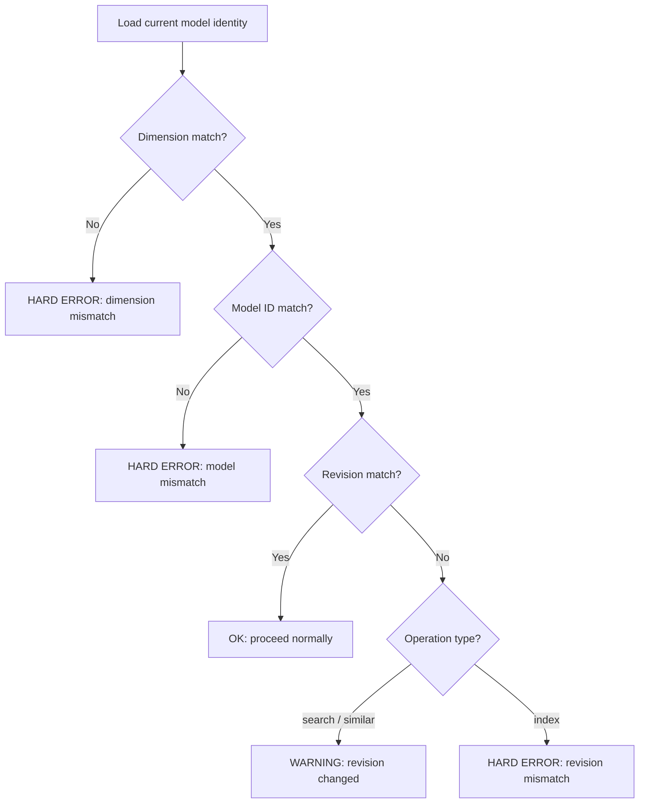

# Workflow: Model Mismatch

**Status: DRAFT**

**Cross-references:** [Terminology](../01-terminology.md) | [Crate: mdvs](../10-crates/mdvs/spec.md) | [Database Schema](../20-database/schema.md)

---

## Overview

Embeddings from different models (or different versions of the same model) are incompatible. Mixing them in the same index produces meaningless search results. Every operation that touches embeddings (`index`, `search`, `similar`) checks model identity before proceeding.

---

## Model Identity

Three values stored in `vault_meta`:

| Field | Source | Example |
|---|---|---|
| `model_id` | HuggingFace repo ID | `minishlab/potion-multilingual-128M` |
| `model_dimension` | Output vector size | `256` |
| `model_revision` | Git commit SHA of downloaded snapshot | `a1b2c3d4e5f6` |

The revision is resolved from the HuggingFace cache directory structure (`~/.cache/huggingface/hub/models--org--name/snapshots/<sha>/`), or directly from `model2vec-rs` if it exposes the commit SHA.

---

## Mismatch Decision Matrix



### Case 1: Dimension Mismatch — Hard Error (always)

The `FLOAT[N]` column would reject vectors of a different size. This is always fatal.

```
Error: Dimension mismatch.
  Database schema expects:  FLOAT[256]  (model: minishlab/potion-multilingual-128M)
  Current model produces:   FLOAT[384]  (model: minishlab/some-other-model)

Run `mdvs reindex` to rebuild with the new model.
```

### Case 2: Model ID Mismatch — Hard Error (always)

Different models produce incompatible embedding spaces, even if dimensions happen to match.

```
Error: Model mismatch.
  Database was indexed with: minishlab/potion-multilingual-128M
  Current config uses:       minishlab/potion-base-32M

Embeddings are incompatible across different models.
Options:
  • Switch back:  mdvs --model minishlab/potion-multilingual-128M search "query"
  • Reindex all:  mdvs reindex
```

### Case 3: Revision Mismatch — Depends on Operation

Same model ID, different commit SHA. The model weights have been updated on HuggingFace.

**For `search` and `similar` (read-only):** Warning. Vectors are likely close but not identical. Results may be slightly inconsistent.

```
Warning: Model revision changed.
  Database indexed with revision: a1b2c3d
  Current model revision:         e4f5g6h

Results may be slightly inconsistent. Run `mdvs reindex` for clean results.
```

**For `index` (writes new embeddings):** Hard error. We must not mix embeddings from different revisions in the same index.

```
Error: Model revision mismatch.
  Database indexed with revision: a1b2c3d
  Current model revision:         e4f5g6h

Cannot add new embeddings with a different model revision.
Options:
  • Pin revision:  set revision = "a1b2c3d" in .mdvs.toml
  • Reindex all:   mdvs reindex
```

### Case 4: All Match — OK

Proceed normally. No output.

---

## Reindex on Model Change

`mdvs reindex` handles model changes:

1. Load the new model, resolve its identity
2. Update `vault_meta` with new model_id, model_dimension, model_revision
3. If dimension changed: `ALTER TABLE chunks DROP COLUMN embedding; ALTER TABLE chunks ADD COLUMN embedding FLOAT[N_new];`
4. `UPDATE chunks SET embedding = NULL`
5. Re-embed all chunks from stored `plain_text`
6. Rebuild HNSW index

Because `plain_text` is stored per-chunk, no filesystem access or re-parsing is needed. For a 5,000-note vault with static embeddings, this takes seconds.

---

## Revision Pinning

Users can pin a specific model revision in `.mdvs.toml`:

```toml
[model]
name = "minishlab/potion-multilingual-128M"
revision = "a1b2c3d4e5f6"
```

When `revision` is set, `model2vec-rs` downloads that exact revision from HuggingFace. This prevents silent model updates from causing revision mismatch warnings.

When `revision` is omitted, the latest available revision is downloaded. Its SHA is recorded in `vault_meta` at init or reindex time.

---

## Edge Cases

| Case | Behavior |
|---|---|
| `vault_meta` missing model keys | Error: database may be corrupted or from an older version |
| Model not in HuggingFace cache | `model2vec-rs` downloads it. If no network, error. |
| Pinned revision not available on HuggingFace | Error from `model2vec-rs`: revision not found |
| `--model` flag overrides config | Current model identity uses the flag value. Mismatch rules still apply. |
| `--revision` flag overrides config | Current revision uses the flag value. |

---

## Related Documents

- [Terminology](../01-terminology.md) — definitions for model identity, reindex
- [Crate: mdvs](../10-crates/mdvs/spec.md) — `model` module
- [Database Schema](../20-database/schema.md) — `vault_meta` keys
- [Configuration: .mdvs.toml](../40-configuration/mdvs-toml.md) — model and revision settings
- [Workflow: Index](index.md) — hard error on revision mismatch during index
- [Workflow: Search](search.md) — warning on revision mismatch during search
