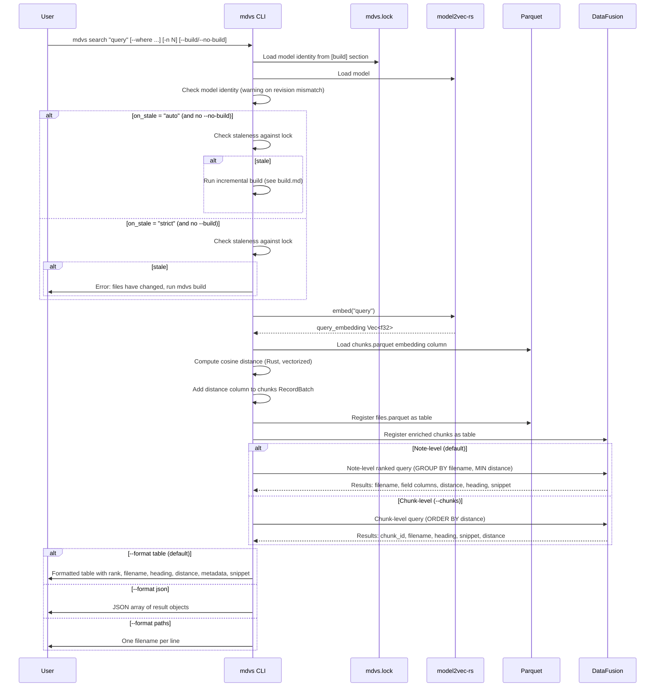

# Workflow: Search

**Status: DRAFT**

**Cross-references:** [Terminology](../01-terminology.md) | [Crate: mdvs](../10-crates/mdvs/spec.md) | [Storage Schema](../20-storage/schema.md)

---

## Overview

The search workflow embeds a user query, computes cosine distance against chunk embeddings, and returns results ranked at the note level (or chunk level with `--chunks`). Auto-build behavior ensures results reflect the current state of files on disk.

---

## Actors

| Actor | Role |
|---|---|
| **User** | Provides query string and optional filters |
| **CLI** | Orchestrates the search |
| **model2vec-rs** | Embeds the query string |
| **Rust** | Cosine distance computation over Arrow arrays |
| **DataFusion** | SQL JOIN, GROUP BY, WHERE, ORDER BY, LIMIT |

---

## Sequence



---

## Auto-Build Behavior

The `on_stale` config key and `--build`/`--no-build` CLI flags interact:

| Config `on_stale` | `--build` | `--no-build` | Result |
|---|---|---|---|
| `auto` | — | — | Build if stale |
| `auto` | — | yes | Skip build |
| `strict` | — | — | Error if stale |
| `strict` | yes | — | Build if stale |
| any | yes | — | Always build |
| any | — | yes | Never build |

Staleness is determined by comparing filesystem content hashes against `mdvs.lock` `[[file]]` entries.

---

## Note-Level Ranking

Default mode. Groups chunk results by file and ranks by best chunk match.

**Strategy:**

- **Score:** Maximum similarity (minimum cosine distance) across all chunks of a file
- **Snippet:** Plain text of the best-matching chunk (truncated to `snippet_length`)
- **Heading:** The heading associated with the best-matching chunk

```sql
SELECT
    f.filename,
    -- [dynamic field columns from schema]
    MIN(c.distance) AS distance,
    FIRST_VALUE(c.heading ORDER BY c.distance) AS best_heading,
    FIRST_VALUE(LEFT(c.plain_text, :snippet_length) ORDER BY c.distance) AS snippet
FROM chunks_with_distance c
JOIN files f ON c.filename = f.filename
-- [optional: WHERE {user_provided_clause}]
GROUP BY f.filename -- [, dynamic field columns]
ORDER BY distance
LIMIT :limit;
```

The `--where` clause operates on `files` table columns (both schema fields and `metadata` JSON). This gives users the full power of DataFusion SQL for filtering.

---

## Chunk-Level Mode (`--chunks`)

Bypasses note-level grouping. Returns individual chunks ranked by similarity.

```sql
SELECT
    c.chunk_id,
    c.filename,
    c.heading,
    LEFT(c.plain_text, :snippet_length) AS snippet,
    c.distance
FROM chunks_with_distance c
JOIN files f ON c.filename = f.filename
-- [optional: WHERE {user_provided_clause}]
ORDER BY c.distance
LIMIT :limit;
```

Useful for finding specific sections across different files, or when a single long file has multiple relevant sections.

---

## Output Formats

### Table (default)

```
── Results for "how does CRDT conflict resolution work" ──

 1. projects/collabide/crdt-design.md § Conflict Resolution    0.142
    [rust, crdt, collaborative]  2025-06-12
    Operational Transform vs CRDT approaches for the editor...

 2. reading/kleppmann-crdt-paper.md § Summary                  0.198
    [papers, distributed-systems]  2025-03-20
    Notes on Martin Kleppmann's paper on conflict-free...

2 results (8ms search, 1ms embed)
```

**Line 1:** Rank, filename, `§ heading` (if present), cosine distance.
**Line 2:** Field values (tags, date, etc.).
**Line 3:** Snippet from the best-matching chunk.
**Footer:** Result count, search time, embedding time.

### JSON

```json
{
  "query": "how does CRDT conflict resolution work",
  "results": [
    {
      "rank": 1,
      "filename": "projects/collabide/crdt-design.md",
      "heading": "Conflict Resolution",
      "distance": 0.142,
      "snippet": "Operational Transform vs CRDT approaches for the editor...",
      "title": "CRDT Design Notes",
      "tags": ["rust", "crdt", "collaborative"],
      "date": "2025-06-12"
    }
  ],
  "timing": {
    "embed_ms": 1,
    "search_ms": 8
  }
}
```

Field values are included as top-level keys in each result object. The field names depend on the schema.

### Paths

```
projects/collabide/crdt-design.md
reading/kleppmann-crdt-paper.md
```

One filename per line. Useful for piping into other tools (`xargs`, `fzf`, editors).

---

## Filter Examples

Filters use DataFusion SQL expressions against `files` table columns:

```bash
# Filter by list column
mdvs search "crdt resolution" --where "tags @> ['rust']"

# Filter by date column
mdvs search "authentication" --where "date > '2025-01-01'"

# Filter by metadata JSON
mdvs search "deployment" --where "json_extract_scalar(metadata, '$.author') = 'edoardo'"

# Combine filters
mdvs search "testing" --where "tags @> ['rust'] AND date > '2024-01-01'"
```

---

## Edge Cases

| Case | Behavior |
|---|---|
| Empty query string | Error: query must not be empty |
| No results found | Exit code 1, message: "No results found." |
| `--where` with syntax error | DataFusion SQL error, surfaced to user with the invalid clause highlighted |
| `--where` referencing non-existent column | DataFusion error, surfaced to user |
| Artifact not built | Error: ".mdvs/ not found. Run `mdvs build` first." (unless auto-build triggers) |
| Empty artifact (init done, no build yet) | No results (chunks Parquet is empty) |
| Model mismatch | See [Model Mismatch Workflow](model-mismatch.md) |

---

## Related Documents

- [Terminology](../01-terminology.md) — definitions for note-level ranking, embedding, cosine distance
- [Crate: mdvs](../10-crates/mdvs/spec.md) — search implementation
- [Storage Schema](../20-storage/schema.md) — query patterns
- [Workflow: Model Mismatch](model-mismatch.md) — identity check before search
- [Workflow: Build](build.md) — auto-build in `on_stale = "auto"` mode
