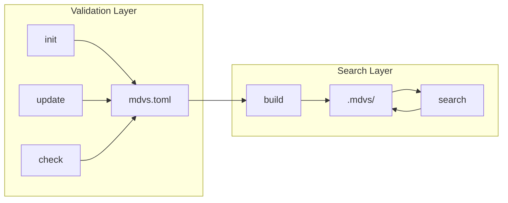
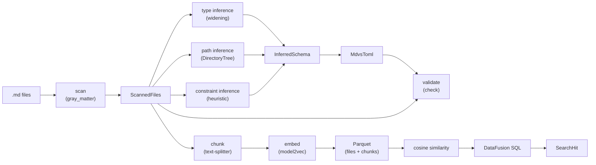

# Architecture

Developer map of the mdvs codebase. For user-facing documentation see the [mdBook](../../book/src/SUMMARY.md). For CLI reference see `mdvs --help`.

## Overview

mdvs has two layers:

- **Validation layer** (init, update, check) — scans markdown, infers schema, validates frontmatter. No model needed. Operates on `mdvs.toml`.
- **Search layer** (build, search) — chunks markdown, embeds text, stores in Parquet, queries with cosine similarity. Requires an embedding model. Operates on `.mdvs/`.

`mdvs.toml` is the single source of truth for schema. There is no lock file. Build metadata (model identity, chunk size) is stored in Parquet native key-value metadata.



## Data Pipeline



Pipeline stages with the key type at each boundary:

1. **Scan** — walk directory, parse YAML frontmatter via `gray_matter` → `ScannedFiles` (`discover/scan.rs:46`)
2. **Type inference** — single pass, widen types across files → `FieldTypeInfo` map (`discover/infer/types.rs:12`, widening at `discover/field_type.rs:29`)
3. **Path inference** — build directory tree, collapse into glob patterns → `FieldPaths` (`discover/infer/paths.rs:12`)
4. **Constraint inference** — categorical heuristic on distinct values → `Option<Constraints>` (`discover/infer/constraints/mod.rs:13`)
5. **Preprocessor inference** — observed widening events drive `Vec<ValueStage>` per field (`preprocess.rs::infer_value_stages`)
6. **Config generation** — combine inferred fields into TOML config → `MdvsToml` (`schema/config.rs`)
7. **Validation** — translate via `dsl_to_canonical`, compile per-field `jsonschema::Validator`, run Stage 2 preprocessors, validate, map errors → `Vec<FieldViolation>` (`cmd/check.rs`)
8. **Chunking** — semantic markdown splitting with line ranges → `Chunks` (`index/chunk.rs:20`)
9. **Embedding** — plain text → dense vector via model2vec → `Vec<f32>` (`index/embed.rs:34`)
10. **Storage** — write Arrow RecordBatches to Parquet → `files.parquet` + `chunks.parquet` (`index/storage.rs`)
11. **Search** — embed query, register DataFusion tables, cosine UDF, SQL JOIN/filter → `Vec<SearchHit>` (`index/backend.rs:18`)

## Module Tree

```
src/
├── lib.rs                              — root module declarations
├── main.rs                             — CLI entry point (clap Command enum, dispatch)
├── block.rs                            — rendering primitives (Block enum, TableStyle, Render trait)
├── step.rs                             — command result types (CommandResult, StepEntry, ErrorKind)
├── output.rs                           — output types (ViolationKind, FieldViolation, DiscoveredField, ChangedField, FieldHint)
├── render.rs                           — format_text() and format_markdown() consuming Vec<Block>
├── table.rs                            — tabled helpers (style_compact, style_record, term_width)
├── search.rs                           — SearchContext, CosineSimilarityUDF, DataFusion view creation
│
├── cmd/
│   ├── init.rs                         — scan → infer → write config (or import via --from-jsonschema)
│   ├── check.rs                        — validate frontmatter via jsonschema, ViolationKey grouping
│   ├── update.rs                       — re-scan, reinfer subcommand, ReinferArgs, categorical flags
│   ├── build.rs                        — check → classify → embed → write parquets
│   ├── search.rs                       — load model → embed query → execute search
│   ├── info.rs                         — show config + index status
│   ├── clean.rs                        — delete .mdvs/
│   └── export_jsonschema.rs            — translate mdvs.toml → JSON Schema (json/toml output)
│
├── discover/
│   ├── scan.rs                         — directory walking, YAML parsing (gray_matter), ScannedFile
│   ├── field_type.rs                   — FieldType enum, from_widen() symmetric widening
│   └── infer/
│       ├── mod.rs                      — InferredField, InferredSchema, orchestrator
│       ├── types.rs                    — FieldTypeInfo (with observed_types), infer_field_types()
│       ├── paths.rs                    — DirectoryTree, GlobMap, FieldPaths, glob collapsing
│       └── constraints/
│           ├── mod.rs                  — infer_constraints() orchestrator
│           └── categories.rs           — categorical heuristic (distinct ≤ max, repetition ≥ min)
│
├── preprocess.rs                       — ValueStage enum (Stage 2), Pipeline, infer_value_stages
│
├── schema/
│   ├── config.rs                       — MdvsToml, TomlField, FieldsConfig, validate(), from_inferred()
│   ├── shared.rs                       — ScanConfig, EmbeddingModelConfig, ChunkingConfig, FieldTypeSerde
│   ├── json_schema.rs                  — dsl_to_canonical, canonical_to_dsl, validate_mdvs_schema, compute_schema_hash
│   ├── load.rs                         — load_schema() (extension-dispatched JSON/TOML parsing)
│   └── constraints/
│       ├── mod.rs                      — Constraints (serde), ConstraintKind (behavior), active(), validate_config()
│       ├── categories.rs               — validate_for_type() (config-time type applicability)
│       ├── length.rs                   — min_length / max_length (config-time type applicability)
│       ├── pattern.rs                  — pattern regex (config-time compile + applicability)
│       └── range.rs                    — min / max (config-time type applicability)
│
├── index/
│   ├── chunk.rs                        — Chunk, Chunks::new() (text-splitter + pulldown-cmark)
│   ├── embed.rs                        — ModelConfig, Embedder (model2vec-rs), cosine_similarity()
│   ├── storage.rs                      — Parquet I/O, column constants, FileRow, ChunkRow, BuildMetadata
│   └── backend.rs                      — Backend enum (ParquetBackend), SearchHit, IndexStats
│
└── outcome/
    ├── mod.rs                          — Outcome enum (one variant per step/command)
    ├── commands/                       — per-command outcomes (InitOutcome, BuildOutcome, etc.)
    │   ├── init.rs, build.rs, search.rs, check.rs, update.rs, clean.rs, info.rs
    └── [step outcomes]                 — ScanOutcome, InferOutcome, ValidateOutcome, ClassifyOutcome,
        ├── scan.rs, infer.rs,            EmbedFilesOutcome, LoadModelOutcome, ReadConfigOutcome,
        ├── validate.rs, classify.rs,     WriteConfigOutcome, ReadIndexOutcome, WriteIndexOutcome,
        ├── embed.rs, model.rs,           DeleteIndexOutcome, ExecuteSearchOutcome
        ├── config.rs, index.rs,
        └── search.rs
```

## Key Types

### Discovery & Inference

| Type | Location | Role |
|------|----------|------|
| `ScannedFile` | `discover/scan.rs:32` | Parsed markdown: path, frontmatter as JSON, body, line offset |
| `ScannedFiles` | `discover/scan.rs:46` | Collection of scanned files, entry point via `::scan()` |
| `FieldType` | `discover/field_type.rs:8` | Recursive type enum (Boolean, Integer, Float, String, Array, Object) |
| `FieldTypeInfo` | `discover/infer/types.rs:12` | Per-field widened type + file list + distinct values + occurrence count |
| `DirectoryTree` | `discover/infer/paths.rs:20` | Arena-based tree for glob pattern collapsing |
| `FieldPaths` | `discover/infer/paths.rs:12` | Inferred allowed + required glob patterns |
| `InferredField` | `discover/infer/mod.rs:26` | Complete field: type, paths, nullable, distinct values |
| `InferredSchema` | `discover/infer/mod.rs:71` | All inferred fields, sorted by name |

### Configuration

| Type | Location | Role |
|------|----------|------|
| `MdvsToml` | `schema/config.rs` | Top-level config, single source of truth. `default_with_fields(fields, ignore)` synthesizes a minimal config from imported JSON Schema |
| `TomlField` | `schema/config.rs` | Per-field definition: type, allowed, required, nullable, constraints, **preprocess** |
| `FieldsConfig` | `schema/config.rs` | Fields section: ignore list, field definitions, inference thresholds |
| `FieldTypeSerde` | `schema/shared.rs` | TOML-serializable type enum (Scalar/Array/Object) |
| `ScanConfig` | `schema/shared.rs` | Glob pattern, include_bare_files, skip_gitignore |
| `EmbeddingModelConfig` | `schema/shared.rs` | Model identity: provider, name, revision |
| `ChunkingConfig` | `schema/shared.rs` | max_chunk_size |
| `Constraints` | `schema/constraints/mod.rs` | Serde layer: `categories`, `min`, `max`, `min_length`, `max_length`, `pattern` (all Option). `#[serde(deny_unknown_fields)]` |
| `ConstraintKind` | `schema/constraints/mod.rs` | Behavior layer enum: `Categories`, `Range { min, max }`, `Length { min, max }`, `Pattern(String)` |
| `ValueStage` | `preprocess.rs` | Stage 2 preprocessor enum: `CoerceToString`, `WidenIntToFloat`. Inherent methods: `applies_to`, `applicable_types`, `apply` (all exhaustive matches) |
| `Pipeline` | `preprocess.rs` | Composed preprocessor for one field. Built via `Pipeline::for_config`; runs via `apply_to_value` |

### Index & Search

| Type | Location | Role |
|------|----------|------|
| `Chunk` | `index/chunk.rs:8` | Semantic chunk: index, start/end lines, plain text |
| `Chunks` | `index/chunk.rs:20` | Newtype wrapping `Vec<Chunk>`, created via `::new()` |
| `ModelConfig` | `index/embed.rs:9` | Resolved model config (enum: Model2Vec variant) |
| `Embedder` | `index/embed.rs:34` | Loaded model (enum: Model2Vec(StaticModel)) |
| `FileRow` | `index/storage.rs:75` | Row for files.parquet (file_id, filepath, data, hash, built_at) |
| `ChunkRow` | `index/storage.rs:89` | Row for chunks.parquet (chunk_id, file_id, index, lines, embedding) |
| `BuildMetadata` | `index/storage.rs:109` | Build config stored in Parquet metadata |
| `FileIndexEntry` | `index/storage.rs:432` | Lightweight projected read for incremental classification |
| `Backend` | `index/backend.rs:41` | Storage backend enum (ParquetBackend variant) |
| `SearchHit` | `index/backend.rs:18` | Query result: filename, score, chunk lines, text |
| `SearchContext` | `search.rs:135` | DataFusion session with tables, view, and cosine UDF |
| `CosineSimilarityUDF` | `search.rs:20` | Custom UDF capturing query vector |

### Output & Rendering

| Type | Location | Role |
|------|----------|------|
| `CommandResult` | `step.rs:90` | Command return: steps list + final result + elapsed_ms |
| `StepEntry` | `step.rs:34` | Completed / Failed / Skipped step |
| `Outcome` | `outcome/mod.rs:41` | Enum with one variant per step/command outcome |
| `Block` | `block.rs:11` | Rendering IR: Line, Table, Section |
| `Render` | `block.rs:56` | Trait: `render_compact()` / `render_verbose()` → `Vec<Block>` |
| `ViolationKind` | `output.rs:173` | Enum: WrongType, Disallowed, MissingRequired, NullNotAllowed, InvalidCategory, OutOfRange, FrontmatterUnrepresentable |
| `FieldViolation` | `output.rs:197` | Grouped violation: field, kind, rule, files |
| `DiscoveredField` | `output.rs:64` | Inferred field for command output |
| `ChangedField` | `output.rs:88` | Field with detected changes (type, allowed, required, nullable) |
| `FieldChange` | `output.rs:98` | Enum of change kinds with old/new values |

## Enum Dispatch Pattern

mdvs uses enum-based dispatch instead of trait objects for all runtime polymorphism. Key enums:

- `FieldType` — type system (6 variants)
- `Backend` — storage backend (1 variant: Parquet; LanceDB planned)
- `Embedder` / `ModelConfig` — embedding provider (1 variant: Model2Vec; Ollama planned)
- `ConstraintKind` — constraint behavior (4 variants: Categories, Range, Length, Pattern)
- `ValueStage` — Stage 2 preprocessors (2 variants: CoerceToString, WidenIntToFloat; more planned)
- `Outcome` — step/command results (~20 variants)
- `Block` — rendering IR (3 variants)

Rationale: single binary (no feature flags for variant selection), exhaustive match guarantees compile-time coverage, no dynamic dispatch overhead. Adding a new variant = add to the enum + implement match arms.

## Validation Pipeline

Post-Wave-B, runtime validation goes through the `jsonschema` crate. Hand-rolled per-value validators have been deleted.

### Stages

1. **Translation** — `dsl_to_canonical(config)` in `schema/json_schema.rs` translates `MdvsToml` into a JSON Schema 2020-12 document. Strict types: `FieldType::String` emits `{"type": "string"}` (no permissive set). Path-scoping is carried as `x-mdvs.allowed` / `x-mdvs.required` per property; preprocessor stages as `x-mdvs.preprocess`.
2. **Gate** — `validate_mdvs_schema(schema)` checks an allow-list of keywords + a hard-reject list for unsupported JSON Schema features (`oneOf`, `$ref`, `format`, etc.) with explanatory messages. Run on any schema before it enters the pipeline (`init --from-jsonschema`, `check --jsonschema`).
3. **Compile** — `validate()` in `cmd/check.rs` builds a per-field `jsonschema::Validator` once per call. Stage 2 preprocessors are applied before validation; values arrive normalized.
4. **Validate** — each frontmatter value runs through its field's compiled validator. Errors map via `map_validation_error` (exhaustive match over `ValidationErrorKind`) into mdvs `ViolationKind`s.

### Error mapping (exhaustive)

| `ValidationErrorKind` (jsonschema) | `ViolationKind` (mdvs) |
|---|---|
| `Type` (instance is null) | `NullNotAllowed` |
| `Type` (other) | `WrongType` |
| `Enum`, `Constant` | `InvalidCategory` |
| `Minimum`, `Maximum`, `ExclusiveMinimum`, `ExclusiveMaximum`, `MultipleOf` | `OutOfRange` |
| `MinLength`, `MaxLength`, `MinItems`, `MaxItems`, `UniqueItems` | `OutOfRange` |
| `Pattern` | `WrongType` |
| `Required` | `MissingRequired` |
| `AdditionalProperties` | `Disallowed` |

Gate-rejected variants (`OneOfNotValid`, `Format`, `Referencing`, etc.) bucket to a "schema gate should reject this — please report" path; reaching one means the gate has drifted.

### Round-trip

`canonical_to_dsl` reverses the translation for `mdvs init --from-jsonschema`. It accepts only the exact shapes `dsl_to_canonical` produces; arbitrary hand-written schemas that pass the gate but use unusual structures (e.g. enum without `type`) error out with a clear message. `mdvs export-jsonschema` round-trips losslessly back to the same `[[fields.field]]` definitions including constraints, path-scoping, and `preprocess` arrays.

## Constraint Architecture

`Constraints` (`schema/constraints/mod.rs`) carries the serde layer: flat `Option<…>` fields mapping directly to `[fields.field.constraints]` in TOML. Fields: `categories`, `min`, `max`, `min_length`, `max_length`, `pattern`. `#[serde(deny_unknown_fields)]` rejects typos. `categories` is closed-set — mutually exclusive with everything else.

`ConstraintKind` (`schema/constraints/mod.rs`) is the behavior enum: `Categories`, `Range { min, max }`, `Length { min, max }`, `Pattern(String)`. Each kind has a `schema/constraints/<kind>.rs` submodule with one config-time function:

- `validate_for_type(field_name, field_type)` → `Option<String>` (is this kind applicable to this field type?)

There is no `validate_value()` at this layer anymore — value-time checks are emitted as JSON Schema keywords by `dsl_to_canonical` and run by `jsonschema`.

`Constraints::validate_config()` runs config-time checks: per-kind type applicability, plus the categories-is-mutually-exclusive rule. Pairwise constraints (e.g. `min` ≤ `max`) are sanity-checked here too.

Inference logic for constraints lives in `discover/infer/constraints/`. Adding a new constraint kind means: serde field on `Constraints`, variant on `ConstraintKind`, submodule under `schema/constraints/`, JSON Schema emission in `dsl_to_canonical`, optional inference in `discover/infer/constraints/`.

## Preprocessor Pipeline

`preprocess.rs` introduces three preprocessing stages by position. Only Stage 2 has built-ins in v0; Stage 1 (`FieldNameStage`) and Stage 3 (`DocumentStage`) are empty enums maintained as scaffolding.

**Stage 2 (`ValueStage`)** is a per-field, per-value transform applied **before** jsonschema validation. Built-ins:

| Variant | Applies to | Behavior |
|---|---|---|
| `CoerceToString` | `String`, `Array(String)` | Non-string JSON value → its `to_string()` representation |
| `WidenIntToFloat` | `Float`, `Array(Float)` | Integer → equivalent float |

Each variant has three inherent methods, all exhaustive matches:

- `applies_to(&FieldType) -> bool`
- `applicable_types() -> &'static str` (for error messages)
- `apply(&Value, &FieldType) -> Option<Value>`

Adding a new variant fails compilation in three places.

**Inference auto-populates `preprocess`** from observed type-widening events. `FieldTypeInfo.observed_types: Vec<FieldType>` collects raw observation types per field. `infer_value_stages(observed, final_type)` returns the implied stages:

- `CoerceToString` when the final type is `String` and observations include non-string types.
- `WidenIntToFloat` when the final type is `Float` and observations include `Integer`.

No implicit defaults — `preprocess = []` means strict.

**`MdvsToml::validate()` invariant 5** (post-Wave-B) enforces that each preprocess entry is applicable to its field type, and that the list contains no duplicates.

### Strict subtype prechecks

For some preprocessor stages, **the absence of the stage** must enforce a check that JSON Schema can't express. These checks run in Rust, before the preprocessor pipeline and before `jsonschema::Validator`.

`CoerceToString`'s absence is enforced naturally: `{"type": "string"}` rejects non-strings.

`WidenIntToFloat`'s absence requires a Rust-side check because JSON Schema can't distinguish `Value::Number(5)` (i64-backed) from `Value::Number(5.0)` (f64-backed) — both match `"number"`, both match `"integer"` (per JSON Schema 2020-12, "integer" matches any number with zero fractional part). YAML and TOML preserve the int/float distinction at parse time (serde_json does too), but JSON Schema operates on the value's mathematical content, not its serde representation.

`preprocess::strict_subtype_check(field, field_type, value) -> Option<String>` is called from `cmd/check.rs::check_field_values` before `pipeline.apply_to_value`. When it returns `Some(detail)`:

- A `ViolationKind::WrongType` violation is emitted with rule `format!("type {}", field.field_type)` and the returned detail (e.g. `"got Integer"`, `"got Integer at index 1"`).
- The preprocessor pipeline and the jsonschema validator are skipped for that value — no double violation.

Current scope: `Float` and `Array(Float)` fields without `WidenIntToFloat` in `preprocess` reject integer-backed values. Future ValueStages with a similar "absence-must-be-enforced-in-Rust" requirement extend the same function.

## Output Pipeline

Three-stage rendering:

1. **Data** — command produces an `Outcome` struct (in `outcome/commands/`)
2. **Blocks** — `Render` trait (`block.rs:56`) converts outcome to `Vec<Block>` via `render_compact()` or `render_verbose()`
3. **Format** — `format_text()` (`render.rs:19`) or `serde_json::to_string_pretty()` produces the final string

`CommandResult` (`step.rs:90`) holds `Vec<StepEntry>` (pipeline steps) + `Result<Outcome, StepError>` (final result). Verbose mode renders steps + result; compact renders result only. JSON uses `#[serde(untagged)]` on `Outcome` for flat serialization.

Every command in `main.rs` follows the same dispatch pattern: call `run()`, check `has_failed()`, choose format, print, set exit code.

## Incremental Build

Build uses content hashing to avoid re-embedding unchanged files (`cmd/build.rs`):

1. **Hash** — `content_hash()` at `index/storage.rs:70` uses xxh3 on the markdown body (after frontmatter extraction)
2. **Classify** — compare scanned files against `FileIndexEntry` from existing `files.parquet`:
   - **New** — no previous entry
   - **Edited** — hash differs
   - **Unchanged** — hash matches
   - **Removed** — in index but not in scan
3. **Skip model** — if no files need embedding, model loading is skipped entirely
4. **Merge** — retained chunks from unchanged files are combined with new chunks at write time
5. **Force** — `--force` triggers full rebuild. Config changes (model, chunk size, prefix) also require `--force`

## Storage Layout

```
.mdvs/
  files.parquet     — one row per markdown file
  chunks.parquet    — one row per chunk
```

**files.parquet** columns: `_file_id` (Utf8), `_filepath` (Utf8), `_data` (Struct — children are frontmatter fields), `_content_hash` (Utf8), `_built_at` (Timestamp). Column constants at `index/storage.rs:26-44`.

**chunks.parquet** columns: `_chunk_id` (Utf8), `_file_id` (Utf8), `_chunk_index` (Int32), `_start_line` (Int32), `_end_line` (Int32), `_embedding` (FixedSizeList<Float32>).

**Build metadata** — stored in Parquet native key-value metadata on `files.parquet` (not a separate file). Keys prefixed `mdvs.`. Composed of `EmbeddingModelConfig` + `ChunkingConfig` + `internal_prefix`. Comparisons via `PartialEq` on `BuildMetadata` (`index/storage.rs:109`).

**Internal prefix** — all Parquet column names are prefixed with `internal_prefix` (default `_`). Configurable in `[search]`. Changing prefix requires `--force` rebuild.

## Search Execution

Search uses DataFusion for SQL query execution (`search.rs`):

1. **Register tables** — `files.parquet` and `chunks.parquet` registered as DataFusion tables
2. **Create view** — `files_v` view promotes `_data` Struct children to top-level columns (e.g., `_data['title'] AS title`), applies aliases from `[search.aliases]`
3. **Cosine UDF** — `CosineSimilarityUDF` (`search.rs:20`) captures the query embedding at creation time, operates on `FixedSizeList<Float32>` chunk embeddings
4. **SQL** — JOINs `files_v` with `chunks`, computes `cosine_similarity(_embedding)`, applies user `--where` clause, groups by file (max chunk score), orders by score DESC, limits results
5. **Note-level ranking** — results are per-file, scored by the best chunk similarity (not average)

## Config Validation

`MdvsToml::validate()` at `schema/config.rs` checks five invariants:

1. **Mutual exclusion** — a field cannot appear in both `[fields].ignore` and `[[fields.field]]`
2. **Valid glob format** — all globs in `allowed`/`required` must end with `/*` or `/**` (or be `*` / `**`)
3. **Required covered by allowed** — every `required` glob must be covered by some `allowed` glob
4. **Constraint validity** — if a field has `[fields.field.constraints]`, the constraint must be valid for the field's type (type applicability + well-formed values + pairwise compatibility)
5. **Preprocess applicability** — each `preprocess` entry must be applicable to the field's type, and the list must contain no duplicates

All invariants bail on first error via `anyhow::bail!()`.

## External Dependencies

| Crate | Purpose |
|-------|---------|
| `clap` | CLI parsing (derive mode) |
| `datafusion` | SQL query engine, re-exports `arrow` + `parquet` |
| `gray_matter` | YAML frontmatter extraction |
| `jsonschema` | JSON Schema 2020-12 per-value validator (Wave B engine) |
| `tomljson` | Workspace crate: lossless TOML↔JSON for schema loading (`.toml` JSON Schemas) |
| `text-splitter` | Semantic markdown chunking |
| `pulldown-cmark` | Markdown to plain text |
| `model2vec-rs` | CPU-only static embedding (POTION models) |
| `indextree` | Arena-based tree for directory inference |
| `ignore` + `globset` | File walking with .gitignore/.mdvsignore |
| `tabled` | Box-drawing table rendering |
| `tracing` + `tracing-tree` | Structured stderr logging |
| `xxhash-rust` | Content hashing (xxh3) for incremental build |
| `tokio` | Async runtime (required by DataFusion) |
| `serde` + `toml` + `serde_json` | Serialization (TOML config, JSON frontmatter) |
| `anyhow` | Error handling |
