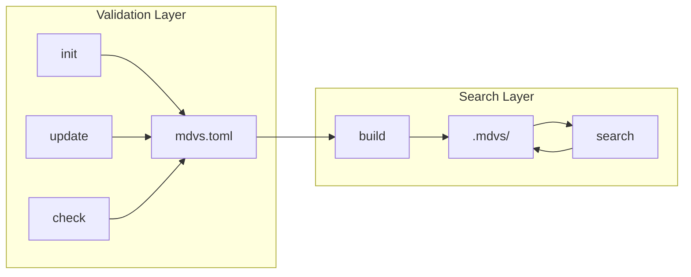
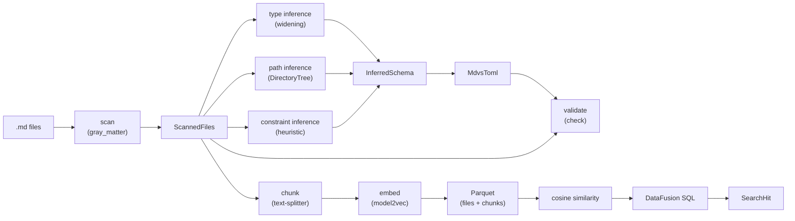

# Architecture

Developer map of the mdvs codebase. For user-facing documentation see the [mdBook](../../book/src/SUMMARY.md). For CLI reference see `mdvs --help`.

## Overview

mdvs has two layers:

- **Validation layer** (init, update, check) — scans markdown, infers schema, validates frontmatter. No model needed. Operates on `mdvs.toml`.
- **Search layer** (build, search) — chunks markdown, embeds text, stores in Parquet, queries with cosine similarity. Requires an embedding model. Operates on `.mdvs/`.

`mdvs.toml` is the single source of truth for schema. There is no lock file. Build metadata (model identity, chunk size) is stored in Parquet native key-value metadata.



## Data Pipeline



Pipeline stages with the key type at each boundary:

1. **Scan** — walk directory, parse YAML frontmatter via `gray_matter` → `ScannedFiles` (`discover/scan.rs:46`)
2. **Type inference** — single pass, widen types across files → `FieldTypeInfo` map (`discover/infer/types.rs:12`, widening at `discover/field_type.rs:29`)
3. **Path inference** — build directory tree, collapse into glob patterns → `FieldPaths` (`discover/infer/paths.rs:12`)
4. **Constraint inference** — categorical heuristic on distinct values → `Option<Constraints>` (`discover/infer/constraints/mod.rs:13`)
5. **Config generation** — combine inferred fields into TOML config → `MdvsToml` (`schema/config.rs:141`)
6. **Validation** — check each file's frontmatter against schema → `Vec<FieldViolation>` (`cmd/check.rs`)
7. **Chunking** — semantic markdown splitting with line ranges → `Chunks` (`index/chunk.rs:20`)
8. **Embedding** — plain text → dense vector via model2vec → `Vec<f32>` (`index/embed.rs:34`)
9. **Storage** — write Arrow RecordBatches to Parquet → `files.parquet` + `chunks.parquet` (`index/storage.rs`)
10. **Search** — embed query, register DataFusion tables, cosine UDF, SQL JOIN/filter → `Vec<SearchHit>` (`index/backend.rs:18`)

## Module Tree

```
src/
├── lib.rs                              — root module declarations
├── main.rs                             — CLI entry point (clap Command enum, dispatch)
├── block.rs                            — rendering primitives (Block enum, TableStyle, Render trait)
├── step.rs                             — command result types (CommandResult, StepEntry, ErrorKind)
├── output.rs                           — output types (ViolationKind, FieldViolation, DiscoveredField, ChangedField, FieldHint)
├── render.rs                           — format_text() and format_markdown() consuming Vec<Block>
├── table.rs                            — tabled helpers (style_compact, style_record, term_width)
├── search.rs                           — SearchContext, CosineSimilarityUDF, DataFusion view creation
│
├── cmd/
│   ├── init.rs                         — scan → infer → write config
│   ├── check.rs                        — validate frontmatter, ViolationKey grouping
│   ├── update.rs                       — re-scan, reinfer subcommand, ReinferArgs, categorical flags
│   ├── build.rs                        — check → classify → embed → write parquets
│   ├── search.rs                       — load model → embed query → execute search
│   ├── info.rs                         — show config + index status
│   └── clean.rs                        — delete .mdvs/
│
├── discover/
│   ├── scan.rs                         — directory walking, YAML parsing (gray_matter), ScannedFile
│   ├── field_type.rs                   — FieldType enum, from_widen() symmetric widening
│   └── infer/
│       ├── mod.rs                      — InferredField, InferredSchema, orchestrator
│       ├── types.rs                    — FieldTypeInfo, infer_field_types(), distinct value collection
│       ├── paths.rs                    — DirectoryTree, GlobMap, FieldPaths, glob collapsing
│       └── constraints/
│           ├── mod.rs                  — infer_constraints() orchestrator
│           └── categories.rs           — categorical heuristic (distinct ≤ max, repetition ≥ min)
│
├── schema/
│   ├── config.rs                       — MdvsToml, TomlField, FieldsConfig, validate(), from_inferred()
│   ├── shared.rs                       — ScanConfig, EmbeddingModelConfig, ChunkingConfig, FieldTypeSerde
│   └── constraints/
│       ├── mod.rs                      — Constraints (serde), ConstraintKind (behavior), active(), validate_config()
│       └── categories.rs              — validate_for_type(), validate_value(), toml_json_eq()
│
├── index/
│   ├── chunk.rs                        — Chunk, Chunks::new() (text-splitter + pulldown-cmark)
│   ├── embed.rs                        — ModelConfig, Embedder (model2vec-rs), cosine_similarity()
│   ├── storage.rs                      — Parquet I/O, column constants, FileRow, ChunkRow, BuildMetadata
│   └── backend.rs                      — Backend enum (ParquetBackend), SearchHit, IndexStats
│
└── outcome/
    ├── mod.rs                          — Outcome enum (one variant per step/command)
    ├── commands/                       — per-command outcomes (InitOutcome, BuildOutcome, etc.)
    │   ├── init.rs, build.rs, search.rs, check.rs, update.rs, clean.rs, info.rs
    └── [step outcomes]                 — ScanOutcome, InferOutcome, ValidateOutcome, ClassifyOutcome,
        ├── scan.rs, infer.rs,            EmbedFilesOutcome, LoadModelOutcome, ReadConfigOutcome,
        ├── validate.rs, classify.rs,     WriteConfigOutcome, ReadIndexOutcome, WriteIndexOutcome,
        ├── embed.rs, model.rs,           DeleteIndexOutcome, ExecuteSearchOutcome
        ├── config.rs, index.rs,
        └── search.rs
```

## Key Types

### Discovery & Inference

| Type | Location | Role |
|------|----------|------|
| `ScannedFile` | `discover/scan.rs:32` | Parsed markdown: path, frontmatter as JSON, body, line offset |
| `ScannedFiles` | `discover/scan.rs:46` | Collection of scanned files, entry point via `::scan()` |
| `FieldType` | `discover/field_type.rs:8` | Recursive type enum (Boolean, Integer, Float, String, Array, Object) |
| `FieldTypeInfo` | `discover/infer/types.rs:12` | Per-field widened type + file list + distinct values + occurrence count |
| `DirectoryTree` | `discover/infer/paths.rs:20` | Arena-based tree for glob pattern collapsing |
| `FieldPaths` | `discover/infer/paths.rs:12` | Inferred allowed + required glob patterns |
| `InferredField` | `discover/infer/mod.rs:26` | Complete field: type, paths, nullable, distinct values |
| `InferredSchema` | `discover/infer/mod.rs:71` | All inferred fields, sorted by name |

### Configuration

| Type | Location | Role |
|------|----------|------|
| `MdvsToml` | `schema/config.rs:141` | Top-level config, single source of truth |
| `TomlField` | `schema/config.rs:63` | Per-field definition: type, allowed, required, nullable, constraints |
| `FieldsConfig` | `schema/config.rs:98` | Fields section: ignore list, field definitions, inference thresholds |
| `FieldTypeSerde` | `schema/shared.rs:12` | TOML-serializable type enum (Scalar/Array/Object) |
| `ScanConfig` | `schema/shared.rs:77` | Glob pattern, include_bare_files, skip_gitignore |
| `EmbeddingModelConfig` | `schema/shared.rs:90` | Model identity: provider, name, revision |
| `ChunkingConfig` | `schema/shared.rs:108` | max_chunk_size |
| `Constraints` | `schema/constraints/mod.rs:23` | Serde layer: `categories: Option<Vec<toml::Value>>` |
| `ConstraintKind` | `schema/constraints/mod.rs:40` | Behavior layer: enum for dispatch (Categories variant) |
| `ConstraintViolation` | `schema/constraints/mod.rs:52` | Violation output: rule + detail strings |

### Index & Search

| Type | Location | Role |
|------|----------|------|
| `Chunk` | `index/chunk.rs:8` | Semantic chunk: index, start/end lines, plain text |
| `Chunks` | `index/chunk.rs:20` | Newtype wrapping `Vec<Chunk>`, created via `::new()` |
| `ModelConfig` | `index/embed.rs:9` | Resolved model config (enum: Model2Vec variant) |
| `Embedder` | `index/embed.rs:34` | Loaded model (enum: Model2Vec(StaticModel)) |
| `FileRow` | `index/storage.rs:75` | Row for files.parquet (file_id, filepath, data, hash, built_at) |
| `ChunkRow` | `index/storage.rs:89` | Row for chunks.parquet (chunk_id, file_id, index, lines, embedding) |
| `BuildMetadata` | `index/storage.rs:109` | Build config stored in Parquet metadata |
| `FileIndexEntry` | `index/storage.rs:432` | Lightweight projected read for incremental classification |
| `Backend` | `index/backend.rs:41` | Storage backend enum (ParquetBackend variant) |
| `SearchHit` | `index/backend.rs:18` | Query result: filename, score, chunk lines, text |
| `SearchContext` | `search.rs:135` | DataFusion session with tables, view, and cosine UDF |
| `CosineSimilarityUDF` | `search.rs:20` | Custom UDF capturing query vector |

### Output & Rendering

| Type | Location | Role |
|------|----------|------|
| `CommandResult` | `step.rs:90` | Command return: steps list + final result + elapsed_ms |
| `StepEntry` | `step.rs:34` | Completed / Failed / Skipped step |
| `Outcome` | `outcome/mod.rs:41` | Enum with one variant per step/command outcome |
| `Block` | `block.rs:11` | Rendering IR: Line, Table, Section |
| `Render` | `block.rs:56` | Trait: `render_compact()` / `render_verbose()` → `Vec<Block>` |
| `ViolationKind` | `output.rs:173` | Enum: WrongType, Disallowed, MissingRequired, NullNotAllowed, InvalidCategory |
| `FieldViolation` | `output.rs:197` | Grouped violation: field, kind, rule, files |
| `DiscoveredField` | `output.rs:64` | Inferred field for command output |
| `ChangedField` | `output.rs:88` | Field with detected changes (type, allowed, required, nullable) |
| `FieldChange` | `output.rs:98` | Enum of change kinds with old/new values |

## Enum Dispatch Pattern

mdvs uses enum-based dispatch instead of trait objects for all runtime polymorphism. Key enums:

- `FieldType` — type system (6 variants)
- `Backend` — storage backend (1 variant: Parquet; LanceDB planned)
- `Embedder` / `ModelConfig` — embedding provider (1 variant: Model2Vec; Ollama planned)
- `ConstraintKind` — constraint behavior (1 variant: Categories; Range/Length/Pattern planned)
- `Outcome` — step/command results (~20 variants)
- `Block` — rendering IR (3 variants)

Rationale: single binary (no feature flags for variant selection), exhaustive match guarantees compile-time coverage, no dynamic dispatch overhead. Adding a new variant = add to the enum + implement match arms.

## Constraint Architecture

Two-layer design with mirrored submodules:

**Serde layer** — `Constraints` struct at `schema/constraints/mod.rs:23`. Flat `Option` fields mapping directly to `[fields.field.constraints]` in TOML. Each constraint kind is one field (`categories`, future: `min`/`max`, `min_length`/`max_length`, `pattern`).

**Behavior layer** — `ConstraintKind` enum at `schema/constraints/mod.rs:40`. Each variant delegates to per-kind submodule functions:
- `validate_for_type(field_name, field_type)` → `Option<String>` (config-time type applicability)
- `validate_value(value, field_type)` → `Option<ConstraintViolation>` (runtime value check)
- `conflicts_with(other, field_name, field_type)` → `Option<String>` (pairwise compatibility)

**Bridge** — `Constraints::active()` at line 66 converts serde `Option` fields to `Vec<ConstraintKind>`.

**Resolver** — `Constraints::validate_config()` at line 88 runs two-phase validation: self-validation per constraint, then pairwise compatibility.

**Mirrored submodules** — validation logic lives in `schema/constraints/categories.rs`, inference logic in `discover/infer/constraints/categories.rs`. Adding a new constraint kind means one file in each.

## Output Pipeline

Three-stage rendering:

1. **Data** — command produces an `Outcome` struct (in `outcome/commands/`)
2. **Blocks** — `Render` trait (`block.rs:56`) converts outcome to `Vec<Block>` via `render_compact()` or `render_verbose()`
3. **Format** — `format_text()` (`render.rs:19`) or `serde_json::to_string_pretty()` produces the final string

`CommandResult` (`step.rs:90`) holds `Vec<StepEntry>` (pipeline steps) + `Result<Outcome, StepError>` (final result). Verbose mode renders steps + result; compact renders result only. JSON uses `#[serde(untagged)]` on `Outcome` for flat serialization.

Every command in `main.rs` follows the same dispatch pattern: call `run()`, check `has_failed()`, choose format, print, set exit code.

## Incremental Build

Build uses content hashing to avoid re-embedding unchanged files (`cmd/build.rs`):

1. **Hash** — `content_hash()` at `index/storage.rs:70` uses xxh3 on the markdown body (after frontmatter extraction)
2. **Classify** — compare scanned files against `FileIndexEntry` from existing `files.parquet`:
   - **New** — no previous entry
   - **Edited** — hash differs
   - **Unchanged** — hash matches
   - **Removed** — in index but not in scan
3. **Skip model** — if no files need embedding, model loading is skipped entirely
4. **Merge** — retained chunks from unchanged files are combined with new chunks at write time
5. **Force** — `--force` triggers full rebuild. Config changes (model, chunk size, prefix) also require `--force`

## Storage Layout

```
.mdvs/
  files.parquet     — one row per markdown file
  chunks.parquet    — one row per chunk
```

**files.parquet** columns: `_file_id` (Utf8), `_filepath` (Utf8), `_data` (Struct — children are frontmatter fields), `_content_hash` (Utf8), `_built_at` (Timestamp). Column constants at `index/storage.rs:26-44`.

**chunks.parquet** columns: `_chunk_id` (Utf8), `_file_id` (Utf8), `_chunk_index` (Int32), `_start_line` (Int32), `_end_line` (Int32), `_embedding` (FixedSizeList<Float32>).

**Build metadata** — stored in Parquet native key-value metadata on `files.parquet` (not a separate file). Keys prefixed `mdvs.`. Composed of `EmbeddingModelConfig` + `ChunkingConfig` + `internal_prefix`. Comparisons via `PartialEq` on `BuildMetadata` (`index/storage.rs:109`).

**Internal prefix** — all Parquet column names are prefixed with `internal_prefix` (default `_`). Configurable in `[search]`. Changing prefix requires `--force` rebuild.

## Search Execution

Search uses DataFusion for SQL query execution (`search.rs`):

1. **Register tables** — `files.parquet` and `chunks.parquet` registered as DataFusion tables
2. **Create view** — `files_v` view promotes `_data` Struct children to top-level columns (e.g., `_data['title'] AS title`), applies aliases from `[search.aliases]`
3. **Cosine UDF** — `CosineSimilarityUDF` (`search.rs:20`) captures the query embedding at creation time, operates on `FixedSizeList<Float32>` chunk embeddings
4. **SQL** — JOINs `files_v` with `chunks`, computes `cosine_similarity(_embedding)`, applies user `--where` clause, groups by file (max chunk score), orders by score DESC, limits results
5. **Note-level ranking** — results are per-file, scored by the best chunk similarity (not average)

## Config Validation

`MdvsToml::validate()` at `schema/config.rs` checks four invariants:

1. **Mutual exclusion** — a field cannot appear in both `[fields].ignore` and `[[fields.field]]`
2. **Valid glob format** — all globs in `allowed`/`required` must end with `/*` or `/**` (or be `*` / `**`)
3. **Required covered by allowed** — every `required` glob must be covered by some `allowed` glob
4. **Constraint validity** — if a field has `[fields.field.constraints]`, the constraint must be valid for the field's type (type applicability + well-formed values + pairwise compatibility)

All invariants bail on first error via `anyhow::bail!()`.

## External Dependencies

| Crate | Purpose |
|-------|---------|
| `clap` | CLI parsing (derive mode) |
| `datafusion` | SQL query engine, re-exports `arrow` + `parquet` |
| `gray_matter` | YAML frontmatter extraction |
| `text-splitter` | Semantic markdown chunking |
| `pulldown-cmark` | Markdown to plain text |
| `model2vec-rs` | CPU-only static embedding (POTION models) |
| `indextree` | Arena-based tree for directory inference |
| `ignore` + `globset` | File walking with .gitignore/.mdvsignore |
| `tabled` | Box-drawing table rendering |
| `tracing` + `tracing-tree` | Structured stderr logging |
| `xxhash-rust` | Content hashing (xxh3) for incremental build |
| `tokio` | Async runtime (required by DataFusion) |
| `serde` + `toml` + `serde_json` | Serialization (TOML config, JSON frontmatter) |
| `anyhow` | Error handling |
